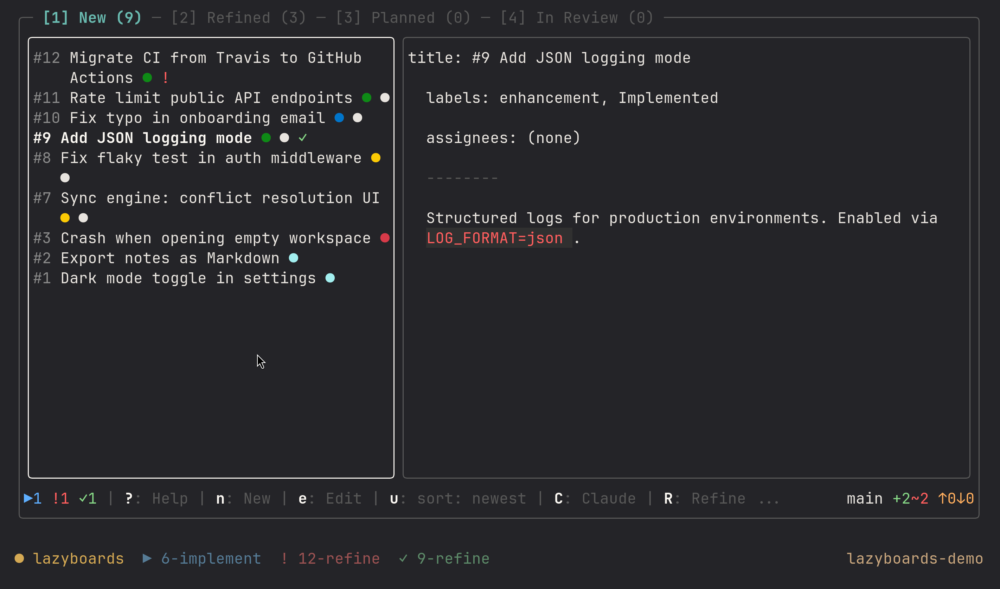
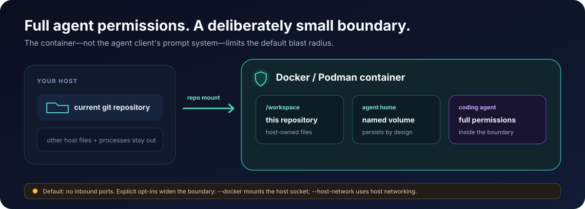

# cenci

**Let coding agents run longer. Keep the important decisions.**

[](#claude-code-codex-and-opencode)
[](flow/docs/codex.md)
[](flow/docs/opencode.md)
[](docs/getting-started.md)
[](LICENSE)

cenci takes a GitHub issue to a tested, reviewed pull request. You approve the intent
and the plan; the agent works at full permissions inside a per-repository container;
live state returns to tmux and optional desktop surfaces so you know when to step in.

[Try it](#quickstart) · [See the workflow](#approve-decisions-not-commands) ·
[Read the security model](SECURITY.md) · [Browse the docs](#learn-more)


One install adds the three operating layers that make longer agent runs practical:

- **Isolation:** limit a full-permission session to a Docker or Podman container.
- **Workflow:** turn an issue into a tested, specialist-reviewed pull request with
  human gates for the decisions that matter.
- **Attention:** see which sessions are running, done, idle, or waiting for you.
- **Maintenance:** keep the repo's own workflow, docs, and client adapters healthy —
  `/cenci:maintain` audits and repairs structure, docs, client adapters, and
  accumulated rules, and works whether or not lazyboards is set up.

## See every session without watching every terminal



cenci-watch marks each tmux window `▶` running, `!` needing input, or `✓` done.
Native Claude Code and Codex hooks update that state immediately; the same signal can
appear in Linux desktop bars and the macOS menu bar. The board shown above is optional
[lazyboards](https://github.com/matteobortolazzo/lazyboards), and the surrounding tmux
theme is user-provided.

[Explore tmux, status commands, and desktop integrations →](watch/README.md)

## Quickstart

Requirements: Linux, macOS, or WSL2; git; curl; Docker or Podman; and Claude Code,
Codex, or both. [OpenCode](flow/docs/opencode.md) is supported as an additional,
opt-in agent — it layers on top of an existing Claude Code or Codex install rather
than standing alone.

**1. Install and verify.**

```bash
curl -fsSL -o install.sh https://github.com/matteobortolazzo/cenci/releases/latest/download/install.sh
curl -fsSL -o install.sh.bundle https://github.com/matteobortolazzo/cenci/releases/latest/download/install.sh.bundle
cosign verify-blob --bundle install.sh.bundle \
  --certificate-identity-regexp '^https://github\.com/matteobortolazzo/cenci/\.github/workflows/watch-release\.yml@refs/tags/watch/v' \
  --certificate-oidc-issuer 'https://token.actions.githubusercontent.com' \
  install.sh
bash install.sh
cenci doctor
```

Requires [cosign](https://docs.sigstore.dev/system_config/installation/) — the installer
verifies its own bytes against the release before running, and fails closed with no
fallback to an unverified ref. The legacy one-liner still works and re-execs itself
through this same verified path:

```bash
curl -fsSL https://raw.githubusercontent.com/matteobortolazzo/cenci/main/install.sh | bash
```

Resolves to the latest release tag by default. That resolved ref pins the client
marketplace manifests and all three plugins' content — not just which install.sh
runs — for every install, update, and repair run. Set `CENCI_REF=main` (or pass
`--ref main`) to explicitly opt into bleeding-edge, unverified main instead (unsafe;
development use only) — it is the only path that intentionally tracks main.

The installer detects your clients, reconciles all three layers on every run (adding
missing components and refreshing existing ones), and puts `cenci` and its `cn` launch
alias on your PATH. `doctor` reports what is ready and what needs attention without
changing anything.

**2. Launch from a git repository.**

```bash
cn      # Claude Code
cn xt   # Codex (or: cn --agent codex)
```

Only that repository is mounted at `/workspace`. The first session also provisions
cenci-watch and starts its shared host daemon.

**3. Run the gated workflow with Claude Code.**

```text
/cenci:configure
/cenci:refine 42
/cenci:implement 42
/cenci:babysit <pr-number>
```

The complete interactive ticket-to-PR workflow is Claude Code-only today. Codex
already supports isolation, monitoring, portable engineering conventions, and PR
babysitting; its native gated workflow is in development.

[Continue with setup details and troubleshooting →](docs/getting-started.md)

## Approve decisions, not commands


You keep scope, tradeoffs, design choices, and plan approval. After that handoff,
cenci handles the worktree, tests, implementation, refactoring, specialist reviews,
rebase, and pull request. `/cenci:babysit` can then follow CI and review activity
through to merge while preserving the same human gates. The approved `.plans/` file
is a durable handoff, so the run can be resumed or dispatched without recreating the
decisions behind it. Normal `/cenci:implement` runs already automatically check
documentation and generated indexes affected by their own changes.

`/cenci:maintain` — audit and repair workflow, docs, client adapters, and accumulated
rules — is a separate, on-demand full-repo audit; it runs standalone and needs no
lazyboards setup.

[Explore the workflow and every skill →](flow/README.md)

## Full speed inside a deliberate boundary



Claude Code runs with `--dangerously-skip-permissions` and Codex with
`--dangerously-bypass-approvals-and-sandbox`, but only inside the container. By
default, cenci mounts the current repository, not your whole host, and publishes no
inbound ports. This limits the host blast radius; you still trust what the agent
installs and runs inside that boundary.

[Understand the sandbox →](sandbox/README.md) ·
[Read its guarantees and limits →](SECURITY.md)

## Optional: use GitHub issues as the cockpit


cenci works from a plain terminal. If you prefer a board, optional lazyboards can
dispatch refinement and implementation with one keypress, show live agent state on
each card, and expose the same session overview. `cenci dispatch` can also pick up an
approved `Planned` ticket by policy. No board or LLM is required for the pickup step.

[Follow the board-orchestration recipe →](docs/orchestration.md) ·
[See the deterministic demo recipe →](demo.tape)

## Claude Code, Codex, and OpenCode

| Client | Ready today |
|---|---|
| **Claude Code** | Full gated workflow, sandbox isolation, live monitoring, optional design, and PR babysitting |
| **Codex** | Sandbox isolation, live monitoring, portable conventions, and PR babysitting; native gated workflow in development |
| **OpenCode** | Sandbox isolation, live monitoring, and portable engineering conventions via `--agent opencode`; opt-in during install and requires an existing Claude Code or Codex install; no native gated workflow, usage-budget tracking, or PR babysitting yet |

All three clients can share one install, one repository, and one board. `cenci run`
chooses an agent per invocation, while `cenci dispatch` can route tickets by
`agent:<name>` label.

[See current delivery status →](docs/roadmap.md) ·
[Read the Codex implementation guide →](flow/docs/codex.md) ·
[Read the OpenCode implementation guide →](flow/docs/opencode.md)

## Learn more

| I want to… | Read… |
|---|---|
| Install, update, or troubleshoot | [Getting started](docs/getting-started.md) |
| Understand the gated engineering workflow | [Workflow guide](flow/README.md) |
| Use tmux, status surfaces, dispatch, or the CLI | [Attention and CLI reference](watch/README.md) |
| Configure and maintain the container boundary | [Isolation guide](sandbox/README.md) and [security model](SECURITY.md) |
| Drive cenci from a GitHub board | [Orchestration recipe](docs/orchestration.md) |
| Check what is available or in development | [Roadmap](docs/roadmap.md) |
| Contribute | [Contributing guide](CONTRIBUTING.md) |
| Upgrade from agent-stack | [Migration guide](docs/migrating-to-cenci.md) |
| Manually verify an OpenCode end-to-end run | [OpenCode smoke matrix](docs/opencode-smoke-matrix.md) |

## License

MIT
