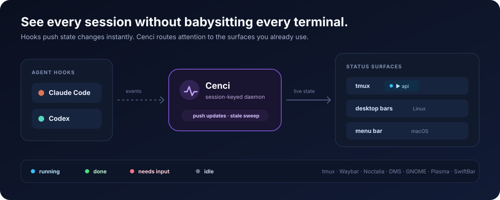

# cenci

**Let coding agents run longer—without giving up control.**

[](#claude-code-and-codex)
[](flow/docs/codex.md)
[](docs/getting-started.md)
[](LICENSE)


Coding agents are useful when they can keep working. They are trustworthy when the
security boundary, approval points, and waiting states are explicit.

cenci provides those missing operating layers as one install:

- **Isolation** limits a full-permission session to a Docker or Podman container.
- **Workflow** turns an issue into a tested, reviewed pull request with human gates.
- **Attention** shows when a session is running, finished, idle, or waiting for you.

Put together: **the board dispatches the work, the workflow owns the decisions, the
container is the security boundary, the watcher routes your attention.** You don't
need the board — cenci works from a plain terminal — but the three layers cenci
installs hold that shape either way.

The human owns intent and consequential decisions. The agent owns the mechanical work
between them.

## From issue to reviewed PR


| You stay responsible for | cenci handles |
|---|---|
| Scope, tradeoffs, and plan review | Worktrees, tests, implementation, and refactoring |
| Design decisions that change the product | Security review, code review, rebase, and PR creation |
| Genuine blockers and final judgment | Session status, follow-through, and optional dispatch |

The approved `.plans/` file is the durable handoff. Once you launch that plan, the
workflow can run unattended through an open PR. cenci-watch keeps its state visible;
[`/cenci:babysit`](flow/README.md#babysitting-a-pr) can follow CI and review
activity through to merge. A `Planned` ticket doesn't require you to launch it by
hand either — `cenci dispatch` can pick it up when it is solely assigned to the
active GitHub CLI user (see
[Quickstart](#quickstart) and the [CLI reference](#cli-reference) below).

Full permissions, contained: the agent runs with `--dangerously-skip-permissions`
(Claude) or `--dangerously-bypass-approvals-and-sandbox` (Codex) so it never stops for
per-command approval, but only inside the container. Host credentials are bind-mounted
read-only and copied into a container-only named volume on first start — never baked
into an image layer — and the container publishes no inbound ports. That still means
you trust what the agent installs and runs *inside* the container; see the
[security model](SECURITY.md) for the full threat model and its explicit limits.

## Quickstart

Requirements: Linux, macOS, or WSL2; git; curl; Docker or Podman; and Claude Code,
Codex, or both.

**1. Install.**

```bash
curl -fsSL https://raw.githubusercontent.com/matteobortolazzo/cenci/main/install.sh | bash
```

The installer detects available clients, registers the marketplace, installs all
three layers, and puts the `cenci` binary — with its `cn` launch alias — on your
PATH.

**2. Verify.** `doctor` changes nothing; it reports required dependencies, detected
clients, optional features, and image readiness:

```bash
cenci doctor
```

Fix anything marked `✗`; warnings for optional features are safe to defer.

**3. Launch** your agent inside the project boundary, from a git repo:

```bash
cn      # Claude Code (cenci open)
cn xt   # Codex (or: cn --agent codex)
```

Only that repository's root is mounted at `/workspace`. cenci-watch needs no separate
install: the first client session provisions it and starts the shared host daemon.

**4. Configure the project**, once, from inside the sandboxed session:

```text
/cenci:configure
```

This detects the stack, writes project guidance (`CLAUDE.md`, `.claude/settings.json`),
and can generate a reviewed per-repository sandbox image. Codex-only users instead
follow the [portable project and implementation guidance](flow/docs/codex.md) — the
interactive configure skill is Claude Code-only.

**5. Run a ticket:**

```text
/cenci:refine 42
/cenci:implement 42
/cenci:babysit <pr-number>
```

`refine` scopes the ticket, `implement` plans it (with a review gate on the saved
plan) and then runs unattended through worktree setup, test-first implementation,
refactoring, security/code review, and PR creation. `babysit` then follows CI and
review comments until the PR merges, performing the final `In Review → Implemented`
board transition. `babysit` is available in both clients through the persistent
`cenci babysit` supervisor; refinement and implementation remain Claude-only today.

For the deeper walkthrough — prerequisites detail, troubleshooting, standalone/recovery
installs, and the `cenci update` maintenance path — see
[Getting started](docs/getting-started.md).

## CLI reference

Every layer ships its own CLI surface under the single `cenci` binary. One row per
command group; full flags live in the linked layer README.

| Command | Purpose | Docs |
|---|---|---|
| `cn` / `cenci open` | Launch a sandboxed session | [sandbox/README.md](sandbox/README.md#usage) |
| `ch`/`cs`/`co`/`cf`, `xl`/`xt`/`xs` | One-token agent+model shortcuts | [sandbox/README.md](sandbox/README.md#usage) |
| `cenci run <workflow> <ticket\|desc>` | Dispatch a workflow into a named tmux window | [watch/README.md](watch/README.md#dispatching-workflows-cenci-run) |
| `cenci dispatch` | Pickup of the current GitHub user's approved `Planned` tickets | [watch/README.md](watch/README.md#auto-dispatch-cenci-dispatch) |
| `cenci close <target>` | Kill a ticket's tmux window via the daemon registry | [watch/README.md](watch/README.md#closing-agent-windows-cenci-close) |
| `cenci sandbox build/prune/ls/stop` | Image and container maintenance | [sandbox/README.md](sandbox/README.md#usage) |
| `cenci status` / `widget-json` | Human/machine status output | [watch/README.md](watch/README.md#human-status-overview-cenci-status) |
| `cenci doctor` / `cenci update` | Install/update the whole stack | [watch/README.md](watch/README.md#installer-integration-cenci-doctor-cenci-update) |

## Three layers, one product

| Layer | What it changes | Learn more |
|---|---|---|
| **cenci-sandbox** | Runs Claude Code or Codex at full permissions while mounting only the current repository at `/workspace`. The container—not a prompt—is the security boundary. | [Isolation details](sandbox/README.md) |
| **cenci** | Adds refinement, optional UI design, persisted planning, test-first implementation, specialist reviews (`/cenci:review`), refactoring proposals (`/cenci:refactor`), and PR follow-through. | [Workflow details](flow/README.md) |
| **cenci-watch** | Turns native hooks into shared live state for tmux and optional Linux/macOS status surfaces. It can also dispatch approved plans by policy (`cenci dispatch`), picking up the active GitHub user's assigned `Planned` tickets without a human relaunching them. | [Attention details](watch/README.md) |

Each layer is independently versioned internally, but normal installation and updates
treat cenci as one product.

## Claude Code and Codex

| Capability | Claude Code | Codex |
|---|---:|---:|
| Container isolation | Yes | Yes |
| Live session monitoring and self-bootstrap | Yes | Yes |
| Portable shell, testing, stack, worktree, and review conventions | Yes | Yes |
| Interactive refinement, design, and implementation | Yes | Not yet |
| Persistent PR babysitting | Yes | Yes |
| Documented implementation recipe | Built in | [Available](flow/docs/codex.md) |

Claude Code currently provides the full interactive ticket-to-PR workflow. Codex uses
the same isolation and attention layers plus portable engineering conventions and a
documented implementation recipe.

This isn't just a capability gap — it's a flexibility story. `cenci run` takes a
per-invocation `--agent`, and `cenci dispatch` routes each ticket by an
`agent:<name>` label (falling back to configured defaults), so which client runs a
given ticket is a per-dispatch choice, not an install-time one. One board, one repo,
and one set of agent-neutral board labels can mix Claude Code and Codex cards side
by side.

## Fits the tools you already use



cenci-watch can surface the same state in tmux, Waybar, Noctalia, DMS, GNOME, KDE
Plasma, and the macOS menu bar. An optional
[lazyboards](https://github.com/matteobortolazzo/lazyboards) board can dispatch the
documented workflow from issue labels; it is a separate project, not an installation
requirement — the installer offers to install it and seed its board config for you
(see [docs/orchestration.md](docs/orchestration.md)).

The lifecycle stays inspectable either way:

```text
New → Refined → [Designed] → Planned → Working → In Review → Implemented
```

## Read next

- [Getting started](docs/getting-started.md) — deeper walkthrough, troubleshooting, and recovery/standalone installs
- [Security model](SECURITY.md) — what the container boundary protects and what it does not
- [Orchestration contract](docs/orchestration.md) — labels, plans, and dispatch behavior
- [Roadmap](docs/roadmap.md) — current delivery status
- [Contributing](CONTRIBUTING.md) — development workflow
- [Migrating from agent-stack](docs/migrating-to-cenci.md) — old→new names for anyone upgrading from a pre-rename install

## License

MIT
