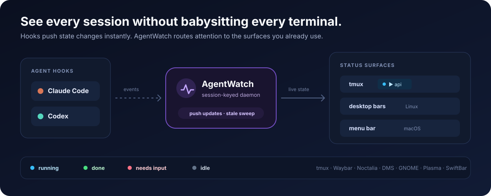

# agentwatch

> Part of [agent-stack](../README.md) — the **attention layer**. See the root README for
> the one-command install and how the isolation, workflow, and attention layers fit together.

Stop hunting through terminals to find the session that needs you. AgentWatch turns
Claude Code and Codex hooks into shared live state for tmux and optional desktop
surfaces.



The same four states appear everywhere:

- **▶ blue** — running (generating, tool use, thinking)
- **✓ green** — done (finished, waiting for next prompt)
- **! red** — need input (permission dialog)
- **~ dim** — idle (fresh prompt, no task yet)

When the agent exits or agentwatch stops, the original window name is restored.

## Architecture

The core daemon keys state by agent session id, maps hook events to statuses, and owns the paneless TTL sweep. All window work is delegated to an injected frontend:

- **tmux frontend** (`internal/frontend/tmux/`): the one interactive frontend — window rename, style, pane-based stale sweep, renumber migration.
- **status JSON** (`internal/frontend/status/`): read-only broadcast in the [Waybar custom module protocol](https://github.com/Alexays/Waybar/wiki/Module:-Custom); consumed by `agentwatch status` and the waybar, noctalia, dms, GNOME Shell (`plugin/gnome/`), KDE Plasma (`plugin/plasma/`), and macOS menu bar ([SwiftBar](https://swiftbar.app), `plugin/macos/`) display widgets.

No polling for normal state changes. Agent hooks push state changes to the daemon instantly via a Unix socket; the daemon sweeps periodically for stale/exited sessions.

## Installation

The easiest path is the [one-command installer](../docs/getting-started.md), which
also wires the macOS menu bar widget when SwiftBar is present:

```bash
curl -fsSL https://raw.githubusercontent.com/matteobortolazzo/agent-stack/main/install.sh | bash
```

The installer handles Claude Code, Codex, or both. The binary and daemon
self-bootstrap from the active client's plugin cache on the first session.

### Advanced / development: standalone client installation

```bash
# Register the repo as a marketplace (works with private repos too)
claude plugin marketplace add matteobortolazzo/agent-stack

# Install the plugin (persists across sessions)
claude plugin install agentwatch

codex plugin marketplace add matteobortolazzo/agent-stack
codex plugin add agentwatch@agent-stack
```

On the first `SessionStart` after install, the plugin downloads the `agentwatch`
binary matching the plugin version (with checksum verification) into the plugin's
`bin/` directory, symlinks it onto your writable `$PATH` (`~/.local/bin`), and
starts the daemon. Bootstrap runs detached and never blocks the agent, so the
very first session may take a moment before status appears; the daemon then
persists for all later sessions.

The on-`$PATH` symlink is re-pointed on every session (so it follows version
bumps) and lets bare `agentwatch` invocations resolve — shell, tmux `run-shell`,
Codex hooks, and waybar-from-shell. **GUI/compositor bars** (DMS, noctalia) are
different: they inherit the *login* PATH, which usually lacks `~/.local/bin`. To
make them find the binary, `install.sh` offers a one-time `sudo` link into
`/usr/local/bin` (which every GUI login PATH includes) chained through the
`~/.local/bin` link, so it too survives version bumps. Decline it and the bar
widgets fall back to their `agentwatchPath` / `AGENTWATCH_BIN` overrides.

Use `agent-stack update` for normal updates. Standalone development installs can use
the corresponding client marketplace update command; the next session re-bootstraps
the matching binary.

Codex will ask you to review/trust new hooks. Use `/hooks` in Codex if the hooks are listed as pending review.

**Trust model:** Codex hash-pins `hooks.json`, so every plugin update that changes
the file changes its hash and requires re-trusting the hooks via `/hooks` in Codex.

The marketplace plugin includes a native Codex manifest at
`plugin/.codex-plugin/plugin.json`, which loads the Codex-specific hooks from
`plugin/codex/hooks.json`.
Plugins and their bundled hooks are stable and enabled by default in current Codex
releases — no feature flag is required.

The Codex hooks self-bootstrap the binary and shared daemon on `SessionStart` even in
a Codex-only installation—see the
[Codex plugin README](plugin/codex/README.md#binary-and-daemon-self-bootstrapping).

## Dispatching workflows (`agentwatch run`)

`agentwatch run` launches a coding-agent CLI for a workflow in a detached tmux
window, owning the `<number>-<skill>` window name that ties board cards, tmux windows,
and watcher snapshots together. It replaces the personal dispatch scripts that used to
live in `~/.config/lazyboards/scripts/`.

```bash
# Refine/design/implement ticket 40 with Claude in the current tmux session
agentwatch run implement 40

# Inspect the resolution without spawning anything
agentwatch run implement 40 --dry-run
# session: my-tmux-session
# window:  40-implement
# command: claude -- '/agentflow:implement 40'
```

Positional args are `<workflow> [ticket-id | task description] [additional context]`;
flags may follow them. Everything after the workflow is forwarded verbatim as the
skill argument (`/agentflow:<workflow> $ARGUMENTS`), so the same free-text forms the skills
accept work here too — no quoting needed:

```bash
# Ticket id plus additional context → window 40-implement (context still reaches the skill)
agentwatch run implement 40 focus on the API layer

# Ticketless task description → window add-dark-mode-toggle
agentwatch run implement add dark mode toggle
```

When the first token is a numeric ticket id, the window is named `<number>-<skill>`
(the skill being the workflow: `refine` / `design` / `implement`) — short, uniform, and
matched by external tools on the number prefix, so the ticket title is deliberately
omitted. `--slug` and trailing context do not change a numbered window's name. A
non-numeric first token (a free-text task description) has no ticket number and keeps a
descriptive slug: `--slug` if given, else the whole description slugified.

| Flag | Purpose |
|------|---------|
| `--agent <name>` | Agent to launch (`claude`, `codex`, …); default from config, else `claude` |
| `--sandbox` / `--no-sandbox` | Sandbox is the default (`claude`→`agent-sand`, the container being the mandatory runtime); `--no-sandbox` is the host opt-out. Both override the config default |
| `--model <model>` | Model override passed to the agent (substituted into `{model}`, else appended as `--model`) |
| `--session <name>` | Target tmux session (default: the current session) |
| `--slug <slug>` | Window-name slug for free-text runs; ignored for numeric tickets (named `<number>-<skill>`) |
| `--config <path>` | Config file (default: `$XDG_CONFIG_HOME/agentwatch/config.json`) |
| `--dry-run` | Print the resolved session, window name, and command without spawning |

A board column action shrinks to a single line:

```yaml
command: "agentwatch run implement {number}"
```

### The join key survives the daemon

`run` creates the window with `automatic-rename off`. When the daemon later tracks it,
it sees the window is manually named and preserves `<number>-<skill>` instead of
overwriting it with the detected task name — so the join key flows through to the
status snapshot's `window_name`.

### Grouped-session guard

New windows propagate to every session in a tmux session group, so `run` refuses to
spawn into a grouped session (non-zero exit, no window created). Pass an ungrouped
`--session` to target a specific session.

### Configuration

Built-in Go templates cover Claude `refine`/`design`/`implement` with zero config. An
optional `config.json` (respecting `$XDG_CONFIG_HOME`, or `--config`) overrides the
defaults and adds agents or workflows — the tokens `{ticket}` and `{model}` are
substituted at launch. Launches run inside the dev-sandbox container by default; the
`"sandbox"` field below is optional and, when set to `false`, opts every launch out to
the host (the same as passing `--no-sandbox`):

```json
{
  "defaultAgent": "claude",
  "sandbox": false,
  "agents": {
    "claude": {
      "command": "claude",
      "sandboxCommand": "agent-sand",
      "workflows": {
        "implement": { "args": ["--", "/agentflow:implement {ticket}"] }
      }
    },
    "codex": {
      "command": "codex",
      "model": "gpt-5.6-sol",
      "workflows": {
        "implement": { "args": ["exec", "/agentflow:implement {ticket}"] }
      }
    },
    "opencode": {
      "command": "opencode",
      "workflows": {
        "implement": { "args": ["run", "implement {ticket}"] }
      }
    }
  }
}
```

Only the built-in Claude templates ship today; Codex and opencode require a
`config.json` entry. Until one is configured, `--agent codex` exits with a helpful "no
launch template" error.

## Auto-dispatch (`agentwatch dispatch`)

Once planning is human-gated and an approved plan shows up on the board as the
`Planned` state, *picking it up* is pure policy — no LLM in the dispatcher.
`agentwatch dispatch` walks the configured repos, matches each `Planned` ticket to
its approved `.plans/<id>-*.md` file, checks capacity/budget gates, and — for every
ticket that clears them — runs exactly what a human would press:
`agentwatch run implement .plans/<file> --agent <chosen>`. The intelligence stays
inside the dispatched sessions; the dispatcher is config plus a pure decision
function.

```bash
# Print the decision table without spawning anything
agentwatch dispatch --dry-run
# owner/name#45 skip: not Planned
# owner/name#78 dispatch (claude, 78-add-cache.md): dispatch

# Run a single pass
agentwatch dispatch --once

# Run continuously, re-evaluating every 5 minutes
agentwatch dispatch --interval 5m

# Run a single failure-reconciliation pass (recover stranded dispatched work)
agentwatch dispatch --reconcile
```

| Flag | Purpose |
|------|---------|
| `--once` | Run a single dispatch pass then exit (the default when neither `--once` nor `--interval` is given) |
| `--interval <dur>` | Re-run on this interval (e.g. `5m`); mutually exclusive with `--once` |
| `--reconcile` | Run one failure-reconciliation pass instead of a dispatch pass (see [Failure reconciliation](#failure-reconciliation)); pair with a cron entry |
| `--dry-run` | Print the decision (or reconciliation) table and mutate nothing |
| `--config <path>` | Config file (default: `$XDG_CONFIG_HOME/agentwatch/config.json`) |
| `--model <model>` | Model override for every session dispatched this pass — overrides `dispatch.model` and `agents.*.model` in `config.json`. With `--interval`, re-applied on every tick (a config reload can't drop it). |

Every ticket yields exactly one logged decision — dispatched or skipped, always with
a reason — so nothing fails silently. When a model is pinned (via `--model` or
`dispatch.model`), the resolved value is logged once per pass
(`dispatch: model override "..."`), so a dispatched session's model is never a
silent surprise — without a pin, it falls back to `agents.*.model`, or otherwise
whatever ambient default the agent CLI itself resolves.

### Enrollment (`agentwatch dispatch enroll|unenroll|status`)

The `dispatch.repos` list (below) is normally managed with these verbs instead of
hand-editing `config.json` — this is how lazyboards (and humans) register a repo for
dispatch:

```bash
agentwatch dispatch enroll   [--dir <path>] [--config <path>]
agentwatch dispatch unenroll [--dir <path>] [--config <path>] [--repo owner/name]
agentwatch dispatch status   [--dir <path>] [--config <path>] [--json]
```

| Verb | Flags | Behavior |
|------|-------|----------|
| `enroll` | `--dir` (default cwd), `--config` | Detects `owner/name` and the absolute dir from `--dir`'s git `origin` remote, then adds/updates the `repos` entry. Idempotent: a second run prints `Already enrolled owner/name (dir)` instead of duplicating the entry. |
| `unenroll` | `--dir`, `--config`, `--repo owner/name` | Removes the `repos` entry. Idempotent: unenrolling a repo that isn't enrolled exits `0` with `Not enrolled: owner/name`. `--repo` unenrolls by name without touching git — use it when the repo's directory has moved or been deleted. `--repo` and an explicitly-passed `--dir` are mutually exclusive (exit `2`) since only one can identify the target. |
| `status` | `--dir`, `--config`, `--json` | Prints the current enrollment state without mutating anything. `--json` emits a single pinned line: `{"repo":"owner/name","dir":"/abs/path","enrolled":true}`; when not enrolled, `dir` is still the **detected** absolute dir (not empty), even if the config file doesn't exist yet. |

Exit codes are consistent across all three verbs: `0` when the verb ran successfully
(enrolled/not-enrolled is a result, not a failure), `1` on a detection/IO error
(`agentwatch dispatch <verb>: <reason>` on stderr), `2` on bad flags (including the
`--repo`/`--dir` conflict above).

### Loop toggle (`agentwatch dispatch loop on|off|status`)

Toggles and reports the embedded fleet dispatch loop (`dispatch.loopEnabled`,
see [Configuration](#configuration)) without hand-editing `config.json`:

```bash
agentwatch dispatch loop on     [--config <path>] [--json]
agentwatch dispatch loop off    [--config <path>] [--json]
agentwatch dispatch loop status [--config <path>] [--json]
```

| Verb | Behavior |
|------|----------|
| `on` | Sets `dispatch.loopEnabled: true` (defaulting `dispatch.daemonInterval` to `"5m"` if unset), then prints the resolved state. |
| `off` | Sets `dispatch.loopEnabled: false`, then prints the resolved state. |
| `status` | Prints the resolved state without mutating anything. |

All three print the same resolved `DispatchState` — human-readable by default, or the
raw JSON object with `--json` (e.g. `{"enabled":true,"daemon_running":false,"interval":"5m",...}`).

**Breaking change:** the loop no longer auto-enables from a bare `daemonInterval`. It
now defaults to disabled and only dispatches once `loopEnabled` is explicitly set to
`true`. Existing installs that relied on `daemonInterval` alone must run `agentwatch
dispatch loop on` (or set `loopEnabled: true` directly) after upgrading, or dispatch
will silently stop.

A running `agentwatch daemon` always starts the embedded dispatch supervisor loop at
startup — `dispatch.loopEnabled` purely controls whether it *performs* passes, not
whether it runs. The loop reloads its config on a hardcoded 60s check interval (not
configurable) to pick up `loopEnabled` changes, so `dispatch loop on`/`off` take effect
within ≤60s of a running daemon, with no daemon restart and no new inbound IPC. While
disabled, the loop still wakes every 60s — it skips the dispatch/reconcile passes but
clears any stale failed-window badges and headroom overlays within that same window.
While enabled, configuration is still polled at least every 60 seconds, but the
dispatch/reconcile pair runs only at the configured `daemonInterval` deadline (and
immediately after enabling). Interval edits recalculate that deadline from the prior
pass completion without creating an extra pass. The loop publishes live state so that
`agentwatch dispatch status --json`'s `"loop"` object (`enabled`, `pass_running`,
`last_run_at`, `last_dispatched`, `last_skipped`, `last_error`) now reflects the live
daemon end-to-end, not just a config fallback. `last_dispatched` counts successful
spawns (not merely dispatch decisions), and `last_error` is intentionally redacted to
`dispatch_pass_failed` or `reconcile_pass_failed`; detailed errors stay in daemon logs.

This daemon-embedded path (`dispatch loop on` alongside a running `agentwatch daemon`)
is the canonical way to run dispatch continuously. `agentwatch dispatch --interval
<duration>` (see [Auto-dispatch](#auto-dispatch-agentwatch-dispatch)) remains a
separate, standalone loop for running dispatch directly from the CLI without a daemon.
It stops and exits nonzero on its first config or pass error; one-shot, dry-run, and
reconcile invocations likewise exit nonzero when their pass fails.

### Pickup rules and gates

A ticket is dispatched only when **all** of these hold, evaluated in order (the first
failing gate is the logged skip reason):

1. carries `Planned`, not `Blocked`, and has no open linked PR;
2. a matching plan for the ticket exists with `status: approved`;
3. the plan is fresh — default-branch commits since its `planCommitSha` are within
   `planStalenessTolerance` (else `plan stale, re-plan`); when the plan's front
   matter lists `stalenessPaths`, only commits touching those paths are counted
   (see [Path-aware staleness](#path-aware-staleness) below);
4. **siblings serialize** — if the plan is a child (`isChild: true`), it waits while
   any sibling (same `parentId`) is active (`Working`, an open PR, or a running
   window) or was already dispatched this pass, so at most one child per parent runs
   at a time;
5. the daemon is reachable (else `daemon unreachable` — never dispatch on unknown
   state);
6. fewer than `needInputThreshold` windows are awaiting input;
7. `running + dispatched-this-pass` is below `concurrencyCap`;
8. the daily quota is not yet spent;
9. the current local time is outside `quietHours`;
10. the resolved agent still has budget (see [Usage budgets](#usage-budgets) — when
    `agentLimits` is set this is computed from real token usage, otherwise from the
    static `agentBudgetFloors`).

#### Path-aware staleness

In a monorepo, unrelated commits elsewhere in the tree shouldn't invalidate a plan
scoped to one project. A plan's front matter may set an optional flat key
`stalenessPaths` — comma-separated, repo-relative paths (e.g.
`stalenessPaths: agentwatch` or `stalenessPaths: agentwatch, agentflow`). When
present, gate 3 above counts only default-branch commits that touch those paths
(`git rev-list --count <planCommitSha>..HEAD -- <paths...>`); when absent, it falls
back to whole-repo commit counting as before. The `agentflow` plan template (see its
`/implement` plan phase) records this field from the project directories the plan
touches.

### Configuration

Dispatch reads the same `config.json` as `run`, under a top-level `"dispatch"` block
(defaults apply when it is absent):

```json
{
  "dispatch": {
    "repos": [
      { "repo": "owner/name", "dir": "/path/to/repo" }
    ],
    "session": "work",
    "concurrencyCap": 3,
    "needInputThreshold": 1,
    "dailyQuota": 20,
    "quietHours": { "startHour": 22, "endHour": 7 },
    "planStalenessTolerance": 5,
    "gracePeriod": "5m",
    "retryBudget": 2,
    "daemonInterval": "5m",
    "defaultAgent": "claude",
    "model": "claude-sonnet-5",
    "agentPreference": ["claude", "codex"],
    "agentBudgetFloors": { "claude": 0.1, "codex": 0.1 },
    "agentLimits": {
      "claude": { "fiveHourTokens": 20000000, "weeklyTokens": 300000000 },
      "codex":  { "fiveHourTokens": 15000000, "weeklyTokens": 200000000 }
    }
  }
}
```

| Key | Default | Purpose |
|-----|---------|---------|
| `repos` | — | Repos to scan; each `dir` holds that repo's `.plans/` and git tree, and a dispatched session `cd`s into it. Normally managed via `agentwatch dispatch enroll`/`unenroll` (see [Enrollment](#enrollment-agentwatch-dispatch-enrollunenrollstatus)) rather than hand-edited, though hand-editing remains supported. |
| `session` | current | Target tmux session for dispatched windows |
| `concurrencyCap` | `3` | Max concurrent running sessions (counts in-flight windows plus this pass's dispatches) |
| `needInputThreshold` | `1` | Pause dispatch when at least this many windows await input |
| `dailyQuota` | `20` | Max dispatches per process run (resets on restart) |
| `quietHours` | none | Local-clock window to suppress dispatch; `startHour > endHour` wraps midnight, `start == end` disables |
| `planStalenessTolerance` | `5` | Max commits a plan may fall behind before it is skipped as stale (see [Path-aware staleness](#path-aware-staleness) for scoping the count via `stalenessPaths`) |
| `gracePeriod` | `5m` | How long the failure signal must hold continuously before the reconciler recovers a stranded ticket (Go duration string) |
| `retryBudget` | `2` | Retries (`Working` → `Planned`) a stranded ticket gets before it is marked `dispatch-failed`; an explicit `0` disables retries |
| `daemonInterval` | none | Dispatch cadence once the embedded loop is enabled (Go duration string); setting this alone does **not** start dispatch — see `loopEnabled`. Configuration is independently polled at least every 60 seconds; nonpositive values use a 60s internal fallback but are not reported as a configured interval |
| `loopEnabled` | `false` | Explicitly toggles the embedded fleet dispatch loop; managed via `agentwatch dispatch loop on\|off` (see [Loop toggle](#loop-toggle-agentwatch-dispatch-loop-onoffstatus)). Defaults to disabled — a bare `daemonInterval` no longer auto-enables the loop; run `dispatch loop on` (or set `loopEnabled: true` directly) to start dispatching |
| `defaultAgent` | `claude` | Agent used when a ticket has no `agent:<name>` label |
| `model` | none | Model override for every dispatched session (overrides `agents.*.model`); the `--model` CLI flag overrides this. Pin this to avoid a dispatched session silently inheriting whatever ambient/account-level default model is active at spawn time |
| `agentPreference` | none | Fallback agent order tried when the primary agent (label or `defaultAgent`) is out of budget; first agent with budget wins |
| `agentBudgetFloors` | none | Per-agent budget floor (see [Usage budgets](#usage-budgets)); with `agentLimits` it is a headroom safety margin, without it a static `Remaining` where `0` pins the agent to "budget exhausted" |
| `agentLimits` | none | Per-agent token caps enabling real usage accounting; each agent takes `fiveHourTokens` and/or `weeklyTokens` (omit or `0` to disable that window) |
| `claudeSessionDir` | `~/.claude/projects` | Override for the Claude session-JSONL directory scanned for output-token usage |
| `codexDBPath` | `~/.codex/state_5.sqlite` | Override for the Codex SQLite DB queried for per-thread token usage (requires the `sqlite3` CLI) |

An agent is routed per ticket from an `agent:<name>` label, falling back to
`defaultAgent`, then to the `agentPreference` list.

### Usage budgets

Each candidate agent must clear a budget gate before it can be dispatched. There are two
modes, chosen per agent by whether `agentLimits` is configured:

- **Real usage accounting** (when `agentLimits[agent]` is set) — agentwatch reads the
  agent's own local session data to compute how much of each rolling window remains:
  Claude from output-token counts in its session JSONL (`claudeSessionDir`), Codex from
  per-thread `tokens_used` in its SQLite DB (`codexDBPath`, via the `sqlite3` CLI). The
  tightest window's headroom (`0.0`–`1.0`) minus the agent's `agentBudgetFloors` value
  is the remaining budget; a positive value passes. Set the floor as a safety margin to
  stop dispatching before the true cap. A missing/unreadable data source is treated as
  the safe direction (no budget) rather than dispatching blind.
- **Static floor** (no `agentLimits[agent]`) — the `agentBudgetFloors` value is used
  directly as the remaining budget, so `0` pins the agent to "budget exhausted" and any
  positive value lets it dispatch. An agent with neither a limit nor a floor is
  unlimited.

### Failure reconciliation

Auto-pickup alone stalls silently on failure: a dispatched session that dies mid-flight
leaves its ticket in `Working`, and pickup requires `Planned`, so the ticket is stranded
forever. Reconciliation is the recovery half — a pass that detects stranded work and
either re-queues or surfaces it.

A `Working` ticket is treated as stranded only when **all** hold: it has no live tmux
window (gone, or `stopped`), no open linked PR, and that signal has held continuously for
`gracePeriod`. When it strands:

- **under `retryBudget`** → `Working` → `Planned` plus an attempt comment; the plan file
  still exists, so the ticket re-enters the dispatch queue naturally;
- **at `retryBudget`** → `Working` → `dispatch-failed`, surfaced for a human and never
  touched again.

The inverse leak — a `Planned` ticket whose approved plan file cannot be read — becomes
`plan-invalid` (also grace-gated, to tolerate a plan that is mid-write or has not yet
synced). An orphan `.plans/` file whose ticket is not open is reported in the log only, no
mutation.

`dispatch-failed` and `plan-invalid` tickets have no tmux window, so the reconciler feeds
the daemon synthetic `failed` entries that the status output and the noctalia/dms widgets
render loud (`failed` outranks every other state). Attempt counts are stored as durable
hidden-marker comments on the ticket, so recovery survives cron invocations and daemon
restarts. A pass never acts blind: if the daemon snapshot or a ticket's attempt count
cannot be read, it defers rather than guess.

Run it two ways:

```bash
# Cron path: one recovery pass per invocation
agentwatch dispatch --reconcile

# Daemon-embedded: set dispatch.daemonInterval and the daemon runs the combined
# dispatch + reconcile loop itself, on that interval
```

> **Host requirement:** reconciliation reads each repo's local `.plans/` directory, so run
> it on the host where plans are persisted. A `Planned` ticket whose plan file lives only
> on another host is grace-gated but will eventually be marked `plan-invalid`.

## Advanced / development

The marketplace install above provisions the binary and daemon automatically. You
only need this section to install the binary by hand (e.g. Codex-only setups),
hack on agentwatch, or run against a local plugin directory.

### Install the binary manually

```bash
go install github.com/matteobortolazzo/agent-stack/agentwatch/v2@latest
```

Or build from source:

```bash
git clone https://github.com/matteobortolazzo/agent-stack.git
cd agent-stack/agentwatch
make build
```

### Run against a local plugin directory

`make plugin-bin` builds the current source into `plugin/bin/agentwatch` and stamps
the version marker, so `claude --plugin-dir ./plugin` uses your local build instead
of downloading a released artifact:

```bash
make plugin-bin
claude --plugin-dir /path/to/agentwatch/plugin
```

### Start the daemon manually

When you install the binary by hand, start the daemon once (the marketplace plugin
does this for you):

```bash
agentwatch        # run in background or a dedicated pane
agentwatch -v     # verbose logging
```

A second `agentwatch daemon` is a safe no-op — it detects the running daemon, logs
"daemon already running", and exits without disturbing it.

| Flag | Default | Description |
|------|---------|-------------|
| `-v` | `false` | Verbose logging |
| `-event-socket` | `$XDG_RUNTIME_DIR/agentwatch/agentwatch-events.sock` | Event socket for hook notifications |
| `-socket` | `$XDG_RUNTIME_DIR/agentwatch/agentwatch.sock` | Broadcast socket for waybar clients |
| `-sweep` | `1` | Stale session reconciliation interval in seconds |
| `-session-ttl` | `2h` | Idle TTL for paneless sessions (Go duration); sessions without a pane are expired after this duration if no `SessionEnd` fires |
| `-style-running` | `fg=blue,dim` | tmux style for running state (inactive windows) |
| `-style-done` | `fg=green,dim` | tmux style for done state (inactive windows) |
| `-style-input` | `fg=red,dim` | tmux style for need-input state (inactive windows) |
| `-style-idle` | `dim` | tmux style for idle state (inactive windows) |
| `-symbol-running` | `▶` | Symbol shown in status bar indicator |
| `-symbol-done` | `✓` | Symbol shown in status bar indicator |
| `-symbol-input` | `!` | Symbol shown in status bar indicator |
| `-symbol-idle` | `~` | Symbol shown in status bar indicator |

### Status / Waybar module

`agentwatch status` connects to the daemon's broadcast socket, reads the current state, prints a single line of JSON in the [Waybar custom module protocol](https://github.com/Alexays/Waybar/wiki/Module:-Custom), and exits. (`agentwatch waybar` is a backwards-compatible alias.)

```bash
agentwatch status
```

| Flag | Default | Description |
|------|---------|-------------|
| `-socket` | `$XDG_RUNTIME_DIR/agentwatch/agentwatch.sock` | Broadcast socket path |
| `-symbol-running` | `▶` | Symbol for running count |
| `-symbol-done` | `✓` | Symbol for done count |
| `-symbol-input` | `!` | Symbol for need-input count |
| `-symbol-dispatch` | `⟳` | Symbol for the fleet dispatch loop indicator (idle/enabled state) |
| `-symbol-dispatch-running` | `⚙` | Symbol for a fleet dispatch pass actively running |

#### Waybar config

```jsonc
"custom/agentwatch": {
    "exec": "agentwatch status",
    "return-type": "json",
    "interval": 1
}
```

Then add `"custom/agentwatch"` to your bar's modules.

#### Waybar styling

The module sets a `class` based on the highest-priority status: `need-input` > `running` > `done` > `idle`.

```css
#custom-agentwatch {
    padding: 0 8px;
}

#custom-agentwatch.need-input {
    color: #f38ba8;
}

#custom-agentwatch.running {
    color: #89b4fa;
}

#custom-agentwatch.done {
    color: #a6e3a1;
}

#custom-agentwatch.idle {
    color: #6c7086;
}
```

#### Budget headroom

When per-agent-type budget headroom is available (see [Usage budgets](#usage-budgets)),
the module appends a compact percentage per agent to `text` and `tooltip`, sorted by
agent name (e.g. `▶ 1  claude 73%  codex 15%`). This is plain text with no Pango
markup — Waybar has no built-in way to color a substring within `text`, so per-agent
threshold coloring is left to frontends that read the raw numeric `headroom` field
directly (see [macOS menu bar](#macos-menu-bar-swiftbar) below). The thresholds
(`>25%` normal, `10–25%` warning, `<10%` critical) are consistent across frontends
even though only SwiftBar currently renders them as color. When no headroom data is
available (budget loop disabled/unconfigured), the `headroom` field and the
percentage text are both omitted entirely — output is unchanged from before this
field existed.

#### Fleet dispatch indicator

When the daemon's fleet dispatch loop is enabled, the module surfaces a `dispatch`
object passed through verbatim from the broadcast snapshot:

```jsonc
{
    "enabled": true,
    "daemon_running": true,
    "interval": "5m",
    "pass_running": false,
    "last_run_at": "2026-07-13T12:04:00Z",
    "last_dispatched": 2,
    "last_skipped": 3
    // "last_error": "..." — present instead of last_run_at/last_dispatched/
    // last_skipped context on a failed run
}
```

At most one dispatch glyph is ever appended to `text`, chosen by priority: while a
pass is actively running (`pass_running: true`) the module shows a distinct
`⚙` glyph (default; override with `-symbol-dispatch-running`); otherwise, if the
loop is enabled but idle, it falls back to the `⟳` glyph (default; override with
`-symbol-dispatch`); if the loop isn't enabled, no dispatch glyph is shown at all.
`tooltip` gets a summary line regardless of which glyph is chosen, e.g. `dispatch:
on (5m) — last run 12:04, 2 dispatched / 3 skipped`, or `dispatch: on (5m) — last
run failed: <err>` after a failed pass — tooltip wording is unaffected by the
running/idle glyph choice. Both `text` and `tooltip` are omitted entirely when the
loop is disabled/absent — byte-compatible with output from before this field
existed.

The `enabled` and `pass_running` fields in the raw `dispatch` JSON object remain
independently available regardless of the max-one-icon rule above — that rule only
governs which single glyph the default Waybar `text`/`tooltip` rendering picks. Any
consumer (GNOME/Plasma/DMS/noctalia widgets) that wants to render both states
independently (e.g. a spinning icon plus a separate enabled indicator) can do so
from the raw fields directly. `class` is unaffected (session-status
priority is unchanged; it stays `"none"` when there are zero live sessions,
dispatch-enabled or not), but `alt` becomes `"dispatch-only"` instead of `"none"`
when there are zero live sessions and the loop is enabled — **`alt`, not `class`, is
what determines whether the module is hidden** (`agentwatch status`'s exit code
follows `alt == "none"`), so the indicator still appears even with no active
sessions. Every non-waybar frontend (noctalia/DMS/GNOME/Plasma/macOS) reads this
same `alt` field to decide visibility.

Since `alt` isn't a stylable CSS class in Waybar (only `class` is — Waybar exposes
`alt` as the `{alt}` text substitution for `format-alt`, not as a `#custom-agentwatch.<alt>`
selector), the dispatch-only glyph inherits whatever `.none` is already styled as:

```css
#custom-agentwatch.none {
    color: #6c7086;
}
```

If you want the dispatch glyph to stand out from the plain "no sessions" case, key
off `format-alt` / `{alt}` instead of CSS — e.g. `"format-alt": "{alt}"` with
`"format-alt-click": "click"` toggles between the compact glyph and the literal
`dispatch-only` alt text on click.

#### macOS menu bar (SwiftBar)

macOS users get the same status surface via a [SwiftBar](https://swiftbar.app)
plugin that consumes the identical `agentwatch status` JSON — no daemon changes. It
shows the counts in the menu bar (loud red on `need-input`) and a per-session
dropdown, and hides when no sessions are live. See
[`plugin/macos/README.md`](plugin/macos/README.md) for install and settings.

#### GNOME Shell (Ubuntu)

Ubuntu's default desktop gets the same status surface via a GNOME Shell 45+
extension that polls `agentwatch status` and adds a top-bar indicator — an icon +
counts colored by the highest-priority status, with a click-through menu listing
each session. It hides when no sessions are live. See
[`plugin/gnome/README.md`](plugin/gnome/README.md) for install and settings.

#### KDE Plasma (Kubuntu)

KDE Plasma 6 users get a native panel widget that consumes the identical
`agentwatch status` JSON — a compact icon + counts with an expandable per-session
list, hidden from the panel when no sessions are live. See
[`plugin/plasma/README.md`](plugin/plasma/README.md) for install and settings.

## Consuming status from your own tool

The daemon broadcasts live status as newline-delimited JSON over a Unix socket.
The public `pkg/watch` package lets any Go tool subscribe to that stream — for
example to badge kanban cards or dashboards with per-window agent status.

```bash
go get github.com/matteobortolazzo/agent-stack/agentwatch/v2
```

It versions via the existing `agentwatch/v*` submodule tags.

```go
import "github.com/matteobortolazzo/agent-stack/agentwatch/v2/pkg/watch"

c, err := watch.Dial(watch.DefaultSocketPath())
// ... handle err; defer c.Close()
for {
    snap, err := c.ReadSnapshot()
    if err != nil {
        break // net.ErrClosed on daemon shutdown
    }
    for _, w := range snap.Windows {
        fmt.Printf("%s: %s\n", w.WindowName, w.Status) // join your cards on WindowName
    }
}
```

The JSON schema is a stable, additive-only contract: fields are only ever added,
never renamed, removed, or repurposed, and unknown fields must be ignored (Go's
`encoding/json` does this by default).

## How it works

### Hook-to-status mapping

#### Claude Code

| Hook Event | Status | Notes |
|------------|--------|-------|
| `SessionStart` | Idle | Fresh session, no task yet |
| `UserPromptSubmit` | Running | User just submitted a prompt |
| `Notification` (permission_prompt) | NeedInput | Permission dialog shown |
| `PreToolUse` (when NeedInput) | Running | Permission was granted |
| `Stop` | Done | Claude finished responding |
| `SessionEnd` | Remove | Restore window, clean up |

#### OpenAI Codex

| Hook Event | Status | Notes |
|------------|--------|-------|
| `SessionStart` | Idle | Fresh session, no task yet |
| `UserPromptSubmit` | Running | User just submitted a prompt |
| `PermissionRequest` | NeedInput | Approval prompt shown |
| `PreToolUse` | Running | Codex is about to run a tool |
| `PostToolUse` | Running | Codex completed a tool call and is still working |
| `Stop` | Done | Codex finished responding |

Codex does not currently document a `SessionEnd` hook. agentwatch restores tracked Codex windows during the stale sweep once the pane returns to a non-Codex command after a completed/idle turn.

For Codex, the first non-empty line of the first submitted prompt becomes the
session's task label. Control characters are removed, whitespace is collapsed,
and the label is capped at 30 characters. The first label stays pinned across
later prompts and native pane-title changes; manually named windows, including
dispatched `<number>-<skill>` windows, remain unchanged.

Only that compact `task_name` is sent over agentwatch's internal hook-event IPC.
The raw prompt and its remaining lines are never transmitted or persisted by
agentwatch.

Codex currently does not emit `PreToolUse` for non-shell/non-MCP tools such as
`request_user_input`. During reconciliation, agentwatch therefore recognizes
Codex's native `[ ! ] Action Required | project` pane title as `need-input`,
keeps the pinned prompt label (or falls back to `project` after a daemon
restart), and recognizes a later braille-spinner title as `running` again.

### Stale session sweep

The daemon has two sweep mechanisms:

**Pane-based sweep (tmux-backed sessions)**: Every 1s (configurable with `-sweep`), the tmux frontend reconciles native agent titles and checks if tracked pane IDs still exist in tmux. If a pane is gone (e.g. an agent crashed without firing a cleanup hook), the window is restored. For Codex, the sweep also detects native input prompts and restores the window after a completed session exits back to the user's shell.

**Paneless TTL sweep**: Sessions without a tmux pane (plain terminals, dev-sandbox without a pane) are tracked by session id only. They are removed on `SessionEnd`; if no `SessionEnd` fires (e.g. a crash or a Codex session), the daemon expires them after the idle TTL (default `2h`, configurable with `-session-ttl`).

### Paneless sessions

`agentwatch notify` accepts events even when `$TMUX_PANE` is unset. Sessions running in plain terminals or dev-sandbox without a tmux pane appear in `agentwatch status` output with empty `session` and `window_index` fields; their tooltip line reads `name (status)` rather than `sess:idx - name (status)`.

**Caveat**: for paneless sessions the task name comes only from the hook payload's `task_name` field — there is no pane title to read. Codex `UserPromptSubmit` hooks provide the compact first-prompt label, but native action-required title detection is only available for tmux-backed sessions.

### Custom status-format integration

agentwatch exposes two per-window user variables for custom `status-format` configs:

- `@agentwatch-symbol` — the status symbol (`~`, `▶`, `✓`, `!`)
- `@agentwatch-style` — the status style (e.g. `fg=blue,dim`)

Use them in your `status-format` to replace the default indicator and color:

```
# Replace ● with agentwatch symbol when active, keep ● otherwise
#{?#{@agentwatch-symbol},#{@agentwatch-symbol},●}

# Use agentwatch style when active, fall back to default color
#{?#{@agentwatch-style},#[#{@agentwatch-style}],#[fg=brightblack]}
```

For users with the default tmux status format, agentwatch automatically prepends `#{@agentwatch-symbol}` to `window-status-format` and `window-status-current-format` during tracking, and restores them on cleanup.

### Budget headroom in status-line

For agent-types with budget tracking configured (see [Usage budgets](#usage-budgets)), agentwatch sets a session-wide (not per-window) tmux user variable per agent-type carrying the remaining budget headroom as an integer percent:

- `@agentwatch-headroom-<agent>` — remaining headroom, `0`–`100` (e.g. `@agentwatch-headroom-claude` → `73`)

Unlike `@agentwatch-symbol`/`@agentwatch-style`, this is a global option (`set-option -g`), not scoped to any one window, since headroom is a per-agent-type fact rather than a per-session/window one. Reference it once in your own `status-line`:

```
set -g status-right "claude: #{@agentwatch-headroom-claude}% | codex: #{@agentwatch-headroom-codex}%"
```

The variable is cleared (absent) when the daemon has no headroom data for that agent-type (budget tracking disabled or unconfigured).

### Manual window names

agentwatch respects manually set window names:

- If a window has `automatic-rename` set to `off` (i.e. you renamed it with `Ctrl+b ,`), agentwatch will show status indicators but keep your window name.
- If you rename a window while an agent is running, agentwatch detects the change and stops overriding your name.
- When the agent exits, manually-named windows keep their name (indicators are removed).

### Daemon restart

If the daemon is absent after a login or restart, the next installed Claude or Codex
hook starts it on demand, waits briefly, and retries that same event. The daemon then
re-discovers the session — a `ListPanes` call maps the `$TMUX_PANE` to the correct
window — and status consumers such as DMS see it on their next poll. Custom
`-event-socket` instances are never started automatically.

**Upgrading past the socket-directory nesting change**: sockets moved from
`$XDG_RUNTIME_DIR/agentwatch*.sock` to `$XDG_RUNTIME_DIR/agentwatch/agentwatch*.sock`
(nested under a dedicated `agentwatch/` subdirectory — see `agentwatch socket-dir`). An
already-running pre-upgrade daemon stays bound to its old path and keeps running there,
harmlessly orphaned. A client on the upgraded binary computes the new nested path,
can't reach that old daemon, and the existing `EnsureRunning()` self-heal spawns a fresh
daemon at the new location on the next call — the same self-heal already documented
above for any other daemon-absent case. No special migration steps are needed.

## Troubleshooting

**No status updates**: Ensure the hook/plugin is loaded (`claude plugin list`, `claude --plugin-dir ./plugin`, or Codex `/hooks`). Check that `agentwatch notify` can reach the event socket (`agentwatch -v` shows the socket path).

**Binary/daemon didn't bootstrap**: The SessionStart bootstrap fails silently so it
never blocks the agent. Check the bootstrap log at
`${TMPDIR:-/tmp}/agentwatch-bootstrap.log` — it records download, checksum, arch,
and network failures (e.g. no release published yet, or an unsupported OS/arch). If
bootstrap can't run, install the binary manually and start the daemon (see
[Advanced / development](#advanced--development)).

**Names not restoring**: agentwatch restores names on clean exit (Ctrl+C / SIGTERM) and via the stale sweep. If it was killed with SIGKILL, manually rename windows or restart tmux.

**Daemon not running**: for the default event socket, `agentwatch notify` starts the
daemon and retries once. Recovery failures remain silent (exit 0), so the agent is
never blocked. Custom event sockets fail silently without starting another instance.

### Verbose mode

When running with `-v`, agentwatch logs compact task names derived from prompt labels or pane titles to stderr. Pane titles may reflect file paths, command output, or other workspace context. Raw prompts are never logged, transmitted, or persisted; task names and window names are truncated to 50 characters in log output to limit exposure.

If verbose logs are persisted (e.g. by a process supervisor), direct output to a user-owned file with restricted permissions:

```bash
agentwatch -v 2>~/.local/state/agentwatch.log
```

## License

MIT
