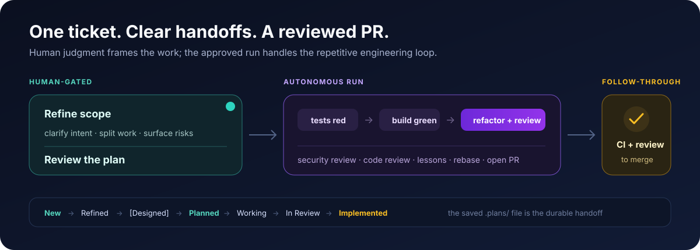

# Getting started

This is the supported happy path from a clean machine to the first agent-stack ticket.
agent-stack is one product; the installer manages its three internal components for
every supported client it detects.


## 1. Prerequisites

Install:

- Linux, macOS, or WSL2
- git
- curl
- Docker or Podman
- Claude Code, Codex, or both

Claude Code is required for the complete interactive ticket-to-PR workflow. A
Codex-only installation still provides container isolation, monitoring, portable
engineering conventions, and the [Codex implementation recipe](../agentflow/docs/codex.md).

Optional features have separate dependencies:

| Feature | Dependency |
|---|---|
| GitHub issues and PRs | [GitHub CLI](https://cli.github.com) authenticated with `gh auth login` |
| tmux status | tmux |
| macOS menu-bar status | [SwiftBar](https://swiftbar.app) |
| desktop status | One of the documented AgentWatch display widgets |

## 2. Install

```bash
curl -fsSL https://raw.githubusercontent.com/matteobortolazzo/agent-stack/main/install.sh | bash
```

From a clone, run `./install.sh`. Non-interactive automation can add `--yes`; use
`./install.sh --help` for the complete public interface.

The installer registers the agent-stack marketplace and installs `agentflow`,
`agentwatch`, and `agent-sandbox` independently for Claude Code, Codex, or both. It
creates only the launchers relevant to detected clients and can build the sandbox
image. AgentWatch self-bootstraps its client-cache binary and daemon on first session.

## 3. Verify

`doctor` changes nothing and separates required platform dependencies, detected
clients, optional feature dependencies, installed components, launchers, and image
readiness:

```bash
agent-stack doctor
```

Warnings for optional features are safe to defer. Fix any required item marked with
`✗` before continuing.

## 4. Launch

Use the launcher installed for your client:

```bash
agent-sand   # Claude Code
sb xt        # Codex (or: agent-sand --agent codex)
```

When launched from a git repository, only that repository root is mounted at
`/workspace`. AgentWatch needs no separate binary install: the first supported client
session provisions it and starts the shared host daemon.

Codex users should also make the repository's canonical `CLAUDE.md` instructions
discoverable by adding this user-level configuration (repository-level Codex config
does not control fallback instruction discovery):

```toml
# ~/.codex/config.toml
project_doc_fallback_filenames = ["CLAUDE.md"]
```

If Codex reports updated plugin hooks as pending, inspect and trust them with `/hooks`.

## 5. Configure a project

In a sandboxed Claude Code session, run once:

```text
/agentflow:configure
```

This detects the stack, writes project guidance, configures workflow metadata, and can
generate a reviewed per-repository sandbox image definition. Codex-only users follow
the [portable project and implementation guidance](../agentflow/docs/codex.md); the
interactive configure skill is Claude Code-only.

## 6. Run a ticket

```text
/agentflow:refine 42
/agentflow:implement 42
/agentflow:babysit <pr-number>
```

After implementation opens the PR, `babysit` checks CI and review feedback
immediately, then schedules progressively quieter checks until the PR merges or
closes. It can fix actionable failures and comments while preserving approval gates;
on merge it performs the final `In Review → Implemented` transition. Babysit is
currently Claude Code-only. See [Babysitting a PR](../agentflow/README.md#babysitting-a-pr)
for pacing, expiry, and safety details.

The lifecycle is always:



For UI work, refinement can branch through a dedicated design ticket. Planning saves
an approved `.plans/` file and applies `Planned`; implementation or automated dispatch
picks it up and applies the transient `Working` state. PR creation applies `In Review`,
and merge completion applies `Implemented`.

## Update

```bash
agent-stack update
```

The command downloads the current official installer, refreshes every installed
component in every detected client, resolves the active AgentWatch cache, refreshes
launchers, and replaces a stale running AgentWatch daemon with the updated binary.

## Troubleshooting

| Symptom | Resolution |
|---|---|
| Neither client is detected | Install Claude Code, Codex, or both, then rerun the installer |
| `agent-stack` or a sandbox launcher is not found | Add `~/.local/bin` to `PATH`, then rerun the install command |
| AgentWatch status has not appeared | Start a new agent session and inspect `${TMPDIR:-/tmp}/agentwatch-bootstrap.log` |
| Codex skills are missing | Confirm `codex plugin list`, then restart Codex after installation |
| Claude commands are missing | Confirm `claude plugin list`, then restart Claude Code after installation |
| Sandbox image is absent | Run `agent-sand --build` or `sb --build` |
| GitHub operations fail | Install `gh` and run `gh auth login` |

Platform and display-specific troubleshooting lives in the internal layer references:
[agent-sandbox](../dev-sandbox/README.md) and [agentwatch](../agentwatch/README.md).

## Advanced and recovery: standalone installation

Use this only when developing a component or recovering a broken installer run. Run
the commands for each client you actually use:

```bash
claude plugin marketplace add matteobortolazzo/agent-stack
claude plugin install agentflow@agent-stack
claude plugin install agentwatch@agent-stack
claude plugin install agent-sandbox@agent-stack

codex plugin marketplace add matteobortolazzo/agent-stack
codex plugin add agentflow@agent-stack
codex plugin add agentwatch@agent-stack
codex plugin add agent-sandbox@agent-stack
```

Then rerun `./install.sh` to restore launchers, AgentWatch wiring, and image setup.
Optional desktop/menu-bar widgets are configured from the relevant
[AgentWatch display documentation](../agentwatch/README.md); they are not another
agent-stack install.
