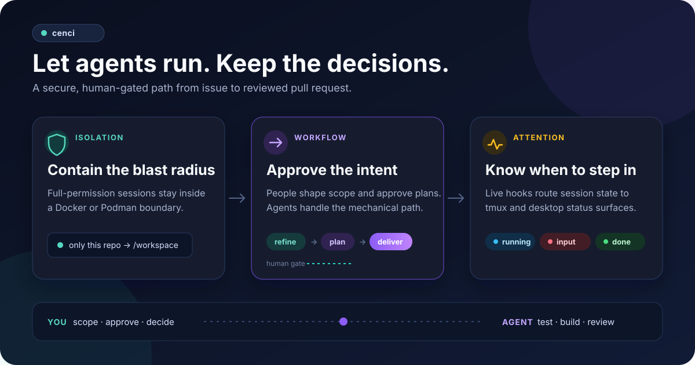

# Getting started

This is the detailed companion to the [README quickstart](../README.md#quickstart) —
use it for prerequisite detail, verification, troubleshooting, and
recovery/standalone installs. The steps below are the same install → verify →
launch → configure → run sequence, just with more depth at each step. cenci is
one product; the installer manages its three internal components for every
supported client it detects.



## 1. Prerequisites

Install:

- Linux, macOS, or WSL2
- git
- curl
- jq
- Docker or Podman
- Claude Code, Codex, or both

Claude Code is required for the complete interactive ticket-to-PR workflow. A
Codex-only installation still provides container isolation, monitoring, portable
engineering conventions, and the [Codex implementation recipe](../flow/docs/codex.md).

[OpenCode](https://opencode.ai) is an additional, opt-in agent layered on top of an
existing Claude Code or Codex install — it is not a standalone option. See
[OpenCode support](#opencode-support-additional-opt-in-agent) below.

Optional features have separate dependencies:

| Feature | Dependency |
|---|---|
| GitHub issues and PRs | [GitHub CLI](https://cli.github.com) authenticated with `gh auth login` |
| tmux status | tmux |
| macOS menu-bar status | [SwiftBar](https://swiftbar.app) |
| desktop status | One of the documented cenci display widgets |

## 2. Install

```bash
curl -fsSL -o install.sh https://github.com/matteobortolazzo/cenci/releases/latest/download/install.sh
curl -fsSL -o install.sh.bundle https://github.com/matteobortolazzo/cenci/releases/latest/download/install.sh.bundle
cosign verify-blob --bundle install.sh.bundle \
  --certificate-identity-regexp '^https://github\.com/matteobortolazzo/cenci/\.github/workflows/watch-release\.yml@refs/(heads/main|tags/watch/v[0-9]+\.[0-9]+\.[0-9]+)$' \
  --certificate-oidc-issuer 'https://token.actions.githubusercontent.com' \
  install.sh
bash install.sh
```

Requires [cosign](https://docs.sigstore.dev/system_config/installation/) — the last
`cosign verify-blob` step checks the downloaded `install.sh` against cenci's pinned
release identity before it runs; verification fails closed, with no fallback to an
unverified ref.

The legacy one-liner still works and re-execs itself through this same verified path:

```bash
curl -fsSL https://raw.githubusercontent.com/matteobortolazzo/cenci/main/install.sh | bash
```

Resolves to the latest release tag by default. That resolved ref pins the client
marketplace manifests and all three plugins' content — not just which install.sh
runs — for every install, update, and repair run. Set `CENCI_REF=main` (or pass
`--ref main`) to explicitly opt into bleeding-edge, unverified main instead (unsafe;
development use only) — it is the only path that intentionally tracks main.

From a clone, run `./install.sh`. Non-interactive automation can add `--yes`; use
`./install.sh --help` for the complete public interface. Every run reconciles the
cenci marketplace and the three components (`cenci`, `cenci-watch`, and
`cenci-sandbox`) for each detected client: it adds missing pieces and refreshes
existing ones. It then puts the `cenci` binary and its `cn` launch alias on your PATH.

## 3. Verify

`doctor` changes nothing and separates required platform dependencies, detected
clients, optional feature dependencies, installed components, launchers, and image
readiness:

```bash
cenci doctor
```

Warnings for optional features are safe to defer. Fix any required item marked with
`✗` before continuing.

## 4. Launch

```bash
cn           # Claude Code
cn xt        # Codex (or: cn --agent codex)
```

Run this from a git repository — only that repository root is mounted at
`/workspace`. cenci-watch needs no separate binary install: the first supported
client session provisions it and starts the shared host daemon.

Codex users should also make the repository's canonical `CLAUDE.md` instructions
discoverable by adding this user-level configuration (repository-level Codex config
does not control fallback instruction discovery):

```toml
# ~/.codex/config.toml
project_doc_fallback_filenames = ["CLAUDE.md"]
```

If Codex reports updated plugin hooks as pending, inspect and trust them with `/hooks`.

## 5. Configure a project

In a sandboxed Claude Code session, run once:

```text
/cenci:configure
```

This detects the stack, writes project guidance, configures workflow metadata, and can
generate a reviewed per-repository sandbox image definition. Codex-only users follow
the [portable project and implementation guidance](../flow/docs/codex.md); the
interactive configure skill is Claude Code-only. See
[flow/README.md's "What `/cenci:configure` creates"](../flow/README.md#what-cenciconfigure-creates)
for the generated file layout, including the monorepo progressive-disclosure structure.

## 6. Keep the project healthy

cenci's maintenance checks are a core workflow feature, not a lazyboards add-on — they
work the same whether or not you ever set up a board.

Every `/cenci:implement` run already automatically checks documentation and generated
indexes affected by the files it changes, and repairs or reports what it finds — no
setup required. Optional `.cenci/config.json` controls change the policy without
disabling correctness: `checkDuringImplement: false` keeps the check report-only,
including CI-blocking `fail` results, which disables the Phase 9 push gate,
`generatedDocs: false` skips marker-bounded generated-section maintenance, and
`maintenance.enabled` controls only scheduled/reminder UX.

For a full, on-demand audit of the whole project — workflow structure, docs, client
adapters (Claude Code, Codex, OpenCode), and accumulated rules — run:

```text
/cenci:maintain
```

It reports findings with proposed repairs and opens a PR with the cleanup once you
approve. See [flow/README.md's maintenance section](../flow/README.md#maintaining-the-project)
for each mode (`structure`, `docs`, `clients`, `rules`).

## 7. Run a ticket

```text
/cenci:refine 42
/cenci:implement 42
/cenci:babysit <pr-number>
```

After implementation opens the PR, `babysit` checks CI and review feedback
immediately, then schedules progressively quieter checks until the PR merges or
closes. It can fix actionable failures and comments while preserving approval gates;
on merge it performs the final `In Review → Implemented` transition. The persistent
supervisor supports both Claude Code and Codex. See
[Babysitting a PR](../flow/README.md#babysitting-a-pr) for pacing and safety details.

The lifecycle is always:


For UI work, refinement can branch through a dedicated design ticket. Planning saves
an approved `.plans/` file and applies `Planned`; implementation or automated dispatch
(`cenci dispatch`) picks it up and applies the transient `Working` state. PR creation
applies `In Review`, and merge completion applies `Implemented`.

## 8. Optional: remove the gates

Everything above keeps you in the loop at refinement, at plan review, and at merge.
Four opt-in switches remove those gates one at a time — up to a chain that runs
refine → plan → implement → PR → merge → next ticket unattended. All four are off by
default, per-repo autonomy is committed to the repo (so the repo decides), and the
per-ticket merge grant stays a human decision.

[The autonomous loop](autonomous-loop.md) has the switch table, a quick start with
working config for both `~/.config/cenci/config.json` and the repo's
`.cenci/config.json`, what still stops the machine, and how to read a held-merge log
line.

## OpenCode support (additional, opt-in agent)

The installer also detects [OpenCode](https://opencode.ai) and, when found, offers an
opt-in integration on top of your existing Claude Code or Codex install — OpenCode is
never a standalone option; `install.sh` still requires Claude Code, Codex, or both.

When OpenCode is detected during install or update, you're asked:

```text
OpenCode detected — link cenci's skills and register its plugin?
```

Accepting symlinks cenci's portable convention skills into OpenCode's skills directory
(see [flow's OpenCode support](../flow/docs/opencode.md)) and registers the cenci-watch
OpenCode plugin (`watch/plugin/opencode`) in `opencode.json`, so OpenCode sessions report
live status the same way Claude Code and Codex sessions do. `cenci uninstall` reverses
both when it runs.

`cenci doctor` reports, separately: whether the detected OpenCode is new enough to
support this integration (the pinned minimum version and known limitations live in
[cenci-watch's OpenCode adapter section](../watch/README.md#dispatching-workflows-cenci-run)),
whether skills are linked and the plugin is registered, and whether a provider is
authenticated. Provider auth is checked via either `ANTHROPIC_API_KEY`/`OPENAI_API_KEY`
in your environment or the presence of `opencode auth login`'s
`~/.local/share/opencode/auth.json` — never a live API call.

Once set up, launch OpenCode with `--agent opencode` (see
[Choosing an agent](../sandbox/README.md#choosing-an-agent)); there is no one-token
shortcut for it yet.

## Update

```bash
cenci update
```

The command refreshes the cenci marketplace through the owning client, then reconciles
all three components in every detected client — missing pieces are added and existing
ones are refreshed. It resolves the active cenci-watch cache, refreshes launchers, and
replaces a stale running cenci daemon with the updated binary. Use
`cenci update --lazyboards` to install or reconcile the optional board binary; an
already-managed lazyboards installation is also refreshed by a normal update.

The components version independently. In particular, a `watch/v0.5.4` release is the
`cenci-watch` plugin release, so update output correctly reports it on the
`cenci-watch` line rather than the `cenci` workflow-plugin line.

`cenci update` now requires `cosign` to be installed — it downloads and verifies a
fresh installer before applying it, the same fail-closed check that piped installs have
always used. If cosign is missing, `cenci update` stops with an actionable message
instead of silently falling back to the currently-installed (possibly stale) installer;
`cenci doctor` reports this as a hard failure rather than a warning.

### Troubleshooting: `cenci update` reports success but the version never changes

Installs pinned before this fix (below `watch/v0.28.1` / `sandbox/v1.14.4` /
`flow/v0.26.0`) ran `cenci update` from their own on-disk, stale installer, which could
never move its own marketplace pin — every step reported success while nothing actually
changed. `cenci doctor` on an affected install now warns that the pin is stale and
prints the recovery commands; if you're not sure, or `cenci doctor` isn't available yet,
recover manually:

```bash
claude plugin marketplace remove cenci
claude plugin marketplace add matteobortolazzo/cenci@watch/v0.28.3
cenci update
cenci --version   # expect >= 0.28.2
```

Substitute the Codex equivalent (`codex plugin marketplace remove/add`) if you use
Codex instead of Claude Code. Once reinstalled at a current release, `cenci update`
self-heals for all future releases and this manual step is no longer needed.

## Uninstall

```bash
cenci uninstall
```

The command removes installed plugins, `PATH` links, the daemon, and config by
delegating to the managed `cenci-installer uninstall` wrapper. `cenci uninstall`
takes no flags or arguments; destructive flags like `--yes` and `--lazyboards`
require invoking `cenci-installer uninstall` directly.

## Troubleshooting

| Symptom | Resolution |
|---|---|
| Neither client is detected | Install Claude Code, Codex, or both, then rerun the installer |
| `cenci` or `cn` is not found | Add `~/.local/bin` to `PATH`, then rerun the install command |
| cenci status has not appeared | Start a new agent session and inspect `${TMPDIR:-/tmp}/cenci-bootstrap.log` |
| Codex skills are missing | Confirm `codex plugin list`, then restart Codex after installation |
| Claude commands are missing | Confirm `claude plugin list`, then restart Claude Code after installation |
| Sandbox image is absent | Run `cenci sandbox build` |
| GitHub operations fail | Install `gh` and run `gh auth login` |

Platform and display-specific troubleshooting lives in the internal layer references:
[cenci-sandbox](../sandbox/README.md) and [cenci-watch](../watch/README.md).

## Advanced and recovery: standalone installation

Use this only when developing a component or recovering a broken installer run. Run
the commands for each client you actually use:

```bash
claude plugin marketplace add matteobortolazzo/cenci
claude plugin install cenci@cenci
claude plugin install cenci-watch@cenci
claude plugin install cenci-sandbox@cenci

codex plugin marketplace add matteobortolazzo/cenci
codex plugin add cenci@cenci
codex plugin add cenci-watch@cenci
codex plugin add cenci-sandbox@cenci
```

Then rerun `./install.sh` to restore launchers, cenci-watch wiring, and image setup.
Optional desktop/menu-bar widgets are configured from the relevant
[cenci-watch display documentation](../watch/README.md); they are not another
cenci install.
