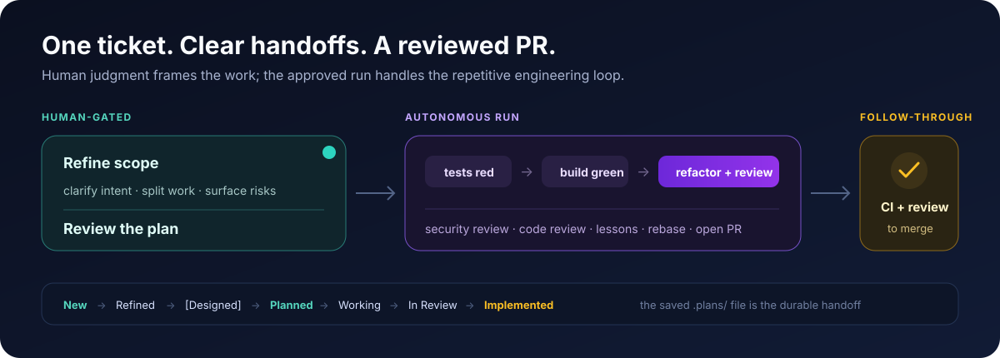

# cenci — Engineering Conventions and Claude Code Workflow

> Part of [cenci](../README.md) — the **workflow layer**. See the root README for
> the one-command install and how the isolation, workflow, and attention layers fit together.

Turn a GitHub ticket into a tested, specialist-reviewed pull request while keeping
scope and planning decisions human-gated.



## What it does

| Skill | Description |
|-------|-------------|
| `/cenci:configure` | Interactive project setup: tech stack, sandboxing, MCP/LSP servers |
| `/cenci:refine <ticket-id>` | Iterative ticket refinement until it's ready for planning |
| `/cenci:design <ticket-id \| description>` | Interactive design reasoning and `.pen` file creation using Pencil |
| `/cenci:implement <ticket-id>` | Full pipeline: plan, test, implement, refactor, security review, code review, lessons, PR |
| `/cenci:refactor [scope]` | Analyze a codebase with specialized subagents and propose refactoring tickets |
| `/cenci:review <pr-number \| file-paths>` | Review code with specialized security, quality, and silent-failure subagents |
| `/cenci:address-review <pr-number>` | Address PR review comments — fetch, evaluate, fix, reply, push, re-request review |
| `/cenci:babysit <pr-number>` | Persistent PR follow-through — periodically checks CI and new review comments and drives them to resolution until the PR merges or closes |
| `/cenci:sync` | Pull latest main, rebase active worktrees, prune stale remotes, clean up merged branches |
| `/cenci:garden [project]` | Curate accumulated lessons — merge duplicate rules, demote rules now covered by automated checks, archive stale ones, and open a PR with the cleanup |

**Codex support**: Codex receives the portable convention skills below plus the full
implementation workflow as a documented `AGENTS.md` equivalent. The interactive
pipeline itself remains Claude Code-only. See [`docs/codex.md`](docs/codex.md).

**OpenCode support**: OpenCode receives the same portable convention skills as real
symlinks via `opencode/install-skills.sh`, plus project guidance as `AGENTS.md` prose.
OpenCode has no plugin marketplace or hook system today, so there is no executable
OpenCode primary agent or `/cenci:*` command yet, and the interactive pipeline itself
remains Claude Code-only. See [`docs/opencode.md`](docs/opencode.md).

## Skill portability

The same `skills/` directory is installed across clients. Portable skills avoid
depending on one client's tools; Claude-only descriptions are deliberately visible in
Codex and OpenCode so neither mistakes a pipeline command for a supported workflow.

| Skill | Claude Code | Codex | OpenCode | Notes |
|-------|-------------|-------|----------|-------|
| `attachments` | Yes | Yes | Yes | Uses the active client's user-input and file/image tools |
| `frontend-classification` | Yes | Yes | Yes | Pure classification rule |
| `pr-comment-filter` | Yes | Yes | Yes | Pure review-filtering rule |
| `shell-rules` | Yes | Yes | Yes | Shared rules with client-specific approval notes |
| `stack-angular` | Yes | Yes | Yes | Framework and test conventions |
| `stack-dotnet` | Yes | Yes | Yes | Framework and test conventions |
| `stack-go` | Yes | Yes | Yes | Framework and test conventions; documentation lookup is client-neutral |
| `subagent-safety` | Yes | Yes | Yes | Shared delegation boundary with client-specific notes |
| `testing` | Yes | Yes | Yes | TDD and test-quality conventions |
| `verify-ui` | Yes | Yes | Yes | Playwright/Pencil visual-verification procedure; browser tooling availability is client-neutral |
| `worktrees` | Yes | Yes | Yes | Git worktree conventions |
| `address-review` | Yes | In development | No | Native approval/checkpoint foundation |
| `babysit` | Yes | Yes | Yes | Thin wrapper over the client-neutral `cenci babysit` supervisor |
| `configure` | Yes | In development | No | Neutral/adapters foundation present |
| `design` | Yes | In development | No | Optional Pencil procedure |
| `garden` | Yes | In development | No | Plan/apply foundation |
| `implement` | Yes | In development | No | Agents/checkpoints foundation |
| `refactor` | Yes | In development | No | Native analysis foundation |
| `refine` | Yes | In development | No | Plan/apply foundation |
| `review` | Yes | In development | No | Native reviewer foundation |
| `sync` | Yes | In development | No | Native procedure foundation |

The table above is hand-curated: whether a pipeline skill counts as fully "Yes" for
Codex vs. still "In development" reflects the state of the native Codex procedure as a
whole, not a single mechanically-derivable fact, so `flow/skills/maintain/scripts/check.sh`
does not regenerate it. The **generated** skill inventory below cross-checks the more
narrowly-derivable facts (front matter, `PORTABLE_SKILLS`, presence of a `codex.md`
companion) for every skill, including the internal ones not listed above.

<!-- cenci-maintain:skills:start -->
<!-- Auto-generated by flow/skills/maintain/scripts/check.sh --write. Do not hand-edit. -->

| Skill | Description | OpenCode | User-invocable | Claude Code | Codex |
|---|---|---|---|---|---|
| `address-review` | Address PR review comments by fetching, evaluating, fixing, replying, pushing, and re-requesting review. | No | Yes | Yes | Yes |
| `attachments` | Discover, select, download, and inspect GitHub ticket attachments. Use when an issue or pull request contains screenshots, mockups, documents, or uploaded files needed as task context. | Yes | No | Yes | Yes |
| `babysit-attention` | Resolve a paused PR supervisor decision with explicit human input. | No | No | Yes | No |
| `babysit` | Follow an open PR with the client-neutral cenci supervisor until it merges or closes. | Yes | Yes | Yes | Yes |
| `ci-repair` | Diagnose and repair failing CI for an existing pull request without reopening the implementation pipeline. | No | No | Yes | No |
| `codex-runtime` | Shared native Codex stage, checkpoint, goal, and agent-adapter contract. | No | No | Yes | No |
| `configure` | Configure cenci's neutral project core and generate Claude/Codex adapters. | No | Yes | Yes | Yes |
| `design` | Run interactive design reasoning and create .pen files using Pencil. | No | Yes | Yes | Yes |
| `frontend-classification` | Classify whether a ticket is frontend or UI work. Use when deciding whether design-aware planning, visual verification, UI tests, or screenshot capture applies. | Yes | No | Yes | Yes |
| `garden` | Curate AGENTS.md critical rules and topic docs through a reviewed PR. | No | Yes | Yes | Yes |
| `implement` | Run the full cenci plan, test, implementation, review, and pull-request pipeline. | No | Yes | Yes | Yes |
| `pr-comment-filter` | Decide which pull-request review comments are actionable. Use when addressing review feedback, monitoring a PR, or filtering already-handled comments. | Yes | No | Yes | Yes |
| `project-core` | Resolve cenci's neutral project configuration and shared guidance consistently. | No | No | Yes | No |
| `refactor` | Analyze a codebase with specialized agents and propose refactoring tickets. | No | Yes | Yes | Yes |
| `refine` | Refine a ticket interactively until it is ready for planning. | No | Yes | Yes | Yes |
| `review` | Review code with specialized security, quality, and silent-failure agents. | No | Yes | Yes | Yes |
| `shell-rules` | Shared shell rules for portable, approval-friendly agent commands. Use when running git, GitHub CLI, builds, tests, cross-directory commands, or commands that write files. | Yes | No | Yes | Yes |
| `stack-angular` | Angular frontend conventions, patterns, and test infrastructure. Use when working with Angular components, services, modules, RxJS, Angular CLI, ng commands, Jasmine tests, Component Harnesses, HttpTestingController, Angular routing, Angular forms, Angular pipes, or Angular dependency injection. | Yes | No | Yes | Yes |
| `stack-dotnet` | .NET backend conventions, patterns, and test infrastructure. Use when working with C# files, .csproj projects, ASP.NET APIs, xUnit tests, FluentAssertions, Entity Framework, WebApplicationFactory, dotnet CLI, NuGet packages, .NET dependency injection, middleware, or controller patterns. | Yes | No | Yes | Yes |
| `stack-go` | Go backend conventions, patterns, and test infrastructure. Use when working with Go files, go.mod projects, Go modules, Go CLI, go build, go test, BubbleTea TUI apps, Lip Gloss styling, Charm libraries, goroutines, channels, interfaces, or Go dependency management. | Yes | No | Yes | Yes |
| `subagent-safety` | Decide which work is safe to delegate to worker agents. Use before delegating tasks that may require user interaction, approval, authentication, external writes, or shared-state mutation. | Yes | No | Yes | Yes |
| `sync` | Sync main, rebase active worktrees, and clean up merged branches safely. | No | Yes | Yes | Yes |
| `testing` | TDD patterns and test quality guidelines. Use when writing tests, setting up test infrastructure, TDD workflow, integration tests, unit tests, test strategy, mocking, test fixtures, test helpers, assertion patterns, test coverage, red-green-refactor cycle, failing tests, test quality review, or test anti-patterns. | Yes | No | Yes | Yes |
| `ticket-ownership` | Establish and verify exclusive ownership of a GitHub issue before refine, design, or implementation work begins. Use from ticket-mode workflows that must claim an unassigned issue for the active GitHub CLI user without replacing existing assignees. | No | No | Yes | No |
| `verify-ui` | Visually verify UI changes with Playwright screenshots and Pencil layout checks before proceeding. Use when a change touches frontend/UI files and needs visual confirmation, not just passing tests. | Yes | No | Yes | Yes |
| `worktrees` | Git worktree patterns for isolated parallel development. Use when creating feature branches, managing git worktrees, isolating feature work, parallel development, setting up a worktree, listing worktrees, worktree naming conventions, or cleaning up worktrees. | Yes | No | Yes | Yes |
<!-- cenci-maintain:skills:end -->

<!-- cenci-maintain:agents:start -->
<!-- Auto-generated by flow/skills/maintain/scripts/check.sh --write. Do not hand-edit. -->

| Agent | Purpose | Referencing skills |
|---|---|---|
| `code-reviewer` | Strict senior developer that reviews PRs for quality, conventions, bugs, and test coverage. Use after implementation for final review before PR. | configure,implement |
| `context-gatherer` | Gathers ticket, design, and project context into a compact bundle file before planning. Use at the start of the implement pipeline so large context (ticket body, comments, DESIGN.md, per-project CLAUDE.md) stays out of the main conversation. | attachments,implement |
| `duplication-analyzer` | Analyzes codebase for duplicated code patterns, copy-paste code, and extraction opportunities. Use when checking for repeated logic across files. | — |
| `implementer` | Senior developer that implements features using TDD — writes tests first, then implementation. Use for writing code, tests, and making builds pass. | implement |
| `lessons-collector` | Reviews implementation sessions and routes genuine mistakes into topic-specific docs (or CLAUDE.md) for future prevention. Use after implementation only when something actually went wrong. | implement |
| `planner` | Senior architect that analyzes tickets and produces implementation plans. Use when planning feature work, analyzing ticket requirements, or breaking down complex tasks. | implement |
| `security-analyzer` | Analyzes codebase for security vulnerabilities using OWASP guidelines and official library documentation via Context7. Use for security audits of application code. | — |
| `security-reviewer` | Security-focused code reviewer that checks for OWASP vulnerabilities, auth issues, and sensitive data exposure. Use after implementation to review security. | implement |
| `silent-failure-hunter` | Detects silent failure patterns — empty catch blocks, swallowed errors, missing error propagation, and silent fallbacks. Use alongside security and code reviewers during the review phase. | implement |
| `structure-analyzer` | Analyzes file sizes, test organization, and module structure to suggest splits and reorganization. Use when checking for oversized files and structural improvements. | — |
<!-- cenci-maintain:agents:end -->

<!-- cenci-maintain:workflow-deps:start -->
<!-- Auto-generated by flow/skills/maintain/scripts/check.sh --write. Do not hand-edit. -->

| Skill | Phases | Reference skills | Scripts | Agents |
|---|---|---|---|---|
| `address-review` | — | babysit,codex-runtime implement,pr-comment-filter project-core,shell-rules subagent-safety,verify-ui | — | — |
| `attachments` | — | shell-rules | — | context-gatherer |
| `babysit-attention` | — | — | — | — |
| `babysit` | — | project-core,shell-rules | tick.sh | — |
| `ci-repair` | — | project-core,shell-rules subagent-safety,testing | — | — |
| `codex-runtime` | — | — | — | — |
| `configure` | — | codex-runtime,shell-rules testing,verify-ui | — | code-reviewer |
| `design` | — | attachments,codex-runtime project-core,shell-rules ticket-ownership | — | — |
| `frontend-classification` | — | implement,refine | — | — |
| `garden` | — | codex-runtime,project-core shell-rules,worktrees | — | — |
| `implement` | phase-1-plan.md,phase-2-worktree.md phase-3-test-red.md,phase-4-implement-green.md phase-5-refactor.md,phase-6-7-review.md phase-8-docs.md,phase-9-pr.md | attachments,codex-runtime frontend-classification,project-core shell-rules,subagent-safety ticket-ownership | — | code-reviewer,context-gatherer |
| `pr-comment-filter` | — | address-review,babysit | — | — |
| `project-core` | — | — | — | — |
| `refactor` | — | codex-runtime,project-core shell-rules,subagent-safety | — | — |
| `refine` | — | attachments,codex-runtime frontend-classification,project-core shell-rules,ticket-ownership | — | — |
| `review` | — | codex-runtime,project-core shell-rules,subagent-safety | — | — |
| `shell-rules` | — | implement | — | — |
| `stack-angular` | — | testing | — | — |
| `stack-dotnet` | — | — | — | — |
| `stack-go` | — | — | — | — |
| `subagent-safety` | — | — | — | — |
| `sync` | — | codex-runtime | — | — |
| `testing` | — | — | — | — |
| `ticket-ownership` | — | — | — | — |
| `verify-ui` | — | address-review,frontend-classification implement | — | — |
| `worktrees` | — | shell-rules | — | — |
<!-- cenci-maintain:workflow-deps:end -->

<!-- cenci-maintain:docs-nav:start -->
<!-- Auto-generated by flow/skills/maintain/scripts/check.sh --write. Do not hand-edit. -->

**Optional integrations**
- `docs/codex.md`
- `docs/opencode.md`

**Core workflow docs**
- `docs/git-workflow.md`
- `docs/pipeline-safety.md`
- `docs/shell-scripting-gotchas.md`
- `docs/skill-authoring.md`
- `docs/ticket-sizing.md`

**Maintainer operations**
<!-- cenci-maintain:docs-nav:end -->

## Prerequisites

### Required
- **Claude Code** CLI installed and authenticated
- **GitHub CLI** (`gh`): for GitHub Issues and PRs — [install](https://cli.github.com/)
- **Node.js**: only required if using Context7 (MCP server for live documentation lookup)

### Optional: LSP Servers

LSP servers provide real-time diagnostics (type errors, unused variables, dead code) during implementation. Install any that match your stack:

| Stack | Server | Install Command |
|-------|--------|----------------|
| TypeScript / JavaScript | typescript-language-server | `npm install -g typescript-language-server typescript` |
| Python | pyright | `pip install pyright` or `npm install -g pyright` |
| Rust | rust-analyzer | See [rust-analyzer docs](https://rust-analyzer.github.io/manual.html#installation) |
| C# / .NET | csharp-ls | `dotnet tool install --global csharp-ls` |
| Go | gopls | `go install golang.org/x/tools/gopls@latest` |

Run `/cenci:configure` to detect and enable LSP servers for your project.

### Authentication

```bash
gh auth login
```
The `gh` CLI stores credentials in `~/.config/gh/hosts.yml`. It also respects `GITHUB_TOKEN`/`GH_TOKEN` env vars as a fallback for non-interactive environments.

### Runtime — the cenci-sandbox container

cenci runs inside the [`sandbox`](../sandbox) container with `--dangerously-skip-permissions`. The **container is the security boundary** — it provides the filesystem and network isolation for autonomous execution, so Claude Code's own host sandbox stays disabled. `permissions.allow`/`deny` are still written to `.claude/settings.json` as defense-in-depth for the case where you run plain `claude` (no skip-permissions) inside the container, e.g. via `cenci open --shell`.

There are no bubblewrap/socat prerequisites — the container supplies the isolation. Launch it with `cn` / `cenci open` (see the [`sandbox` README](../sandbox)), then run `/cenci:configure` inside it.

## Installation

The [one-command installer](../docs/getting-started.md) installs cenci together with
the other layers, checks prerequisites, and walks you through the setup:

```bash
curl -fsSL https://raw.githubusercontent.com/matteobortolazzo/cenci/main/install.sh | bash
```

### Advanced / development: standalone installation

```bash
# Claude Code
claude plugin marketplace add matteobortolazzo/cenci
claude plugin install cenci

# Codex (separate client-local install, same marketplace)
codex plugin marketplace add matteobortolazzo/cenci
codex plugin add cenci@cenci
```

To update later, run the cenci installer or the corresponding client's
marketplace/plugin update commands.

### Manual (per-session)

```bash
claude --plugin-dir /path/to/flow
```

## Quick Start

```bash
# 1. Start Claude Code (plugin loads automatically if installed via marketplace)
claude

# 2. Configure the project (one-time setup)
/cenci:configure

# 3. Refine a ticket (optional but recommended)
/cenci:refine 12345

# 4. Design a ticket (optional — for frontend/UI tickets)
/cenci:design 12345

# 5. Implement a ticket
/cenci:implement 12345
```

## Working from your phone

cenci skills (`/refine`, `/implement`, `/design`) are **interactive** — they ask clarifying questions and iterate. Triggering them via one-shot mechanisms (GitHub Actions, webhook, `claude --print`) drops all conversation state after each turn, which defeats their whole design.

**The fit-for-purpose answer is SSH + tmux**, which you probably already have:

1. **On laptop**: keep Claude Code running in a named tmux window (e.g. `tmux new -As cenci`).
2. **Expose the laptop to your phone** via [Tailscale](https://tailscale.com) (or any VPN/SSH-accessible network).
3. **On phone**: install an SSH client — [Blink](https://blink.sh) (iOS), [Termius](https://termius.com) (iOS/Android), or [Termux](https://termux.dev) (Android).
4. **From phone**: SSH into your laptop, `tmux attach -t cenci`, and type `/cenci:refine 42` — you get the full interactive experience. Close the app; tmux keeps the session alive; reconnect anytime.

**Why this beats GH-comment or remote bots:**
- Real conversation state — skills ask questions, you answer, they proceed. Just like your desk.
- `/clear`, `/compact`, and every other Claude Code feature works normally.
- No new code to maintain, no webhook infra, no session-resume plumbing.
- Browse issues in the GH mobile app; trigger skills via SSH. Two apps, zero friction.

### What `/cenci:configure` creates

```
your-project/
├── AGENTS.md              # canonical shared project guidance
├── CLAUDE.md              # generated @AGENTS.md adapter
├── .claudeignore          # Files tracked by git but excluded from Claude's context
├── docs/
│   └── git-workflow.md    # On-demand reference: branching, commits, PRs
├── .cenci/config.json     # canonical client-neutral configuration
├── .claude/settings.json  # Claude-specific adapter
└── .worktrees/            # Git worktrees for feature branches (gitignored)
```

**Where reference docs live**

- `docs/<topic>.md` — on-demand reference docs read by skills/agents when their topic intersects the work. The lessons-collector also routes new topic-specific lessons here.
- `AGENTS.md` — canonical shared critical rules and project-wide invariants.
- `CLAUDE.md` — generated import adapter with an optional Claude-only block.
- `.claude/rules/` — reserved for files explicitly `@`-imported by `CLAUDE.md` (auto-loaded at session start). Configure does not create files here today.

**Lesson lifecycle**

Rules only enter through the lessons-collector (append, after implementation sessions) and only leave through `/cenci:garden` (curation, human-gated). Because `CLAUDE.md` is loaded into every session, each rule it holds is a permanent context cost — gardening periodically merges duplicates, moves non-invariants into on-demand `docs/<topic>.md` files, demotes rules that a regression test or lint gate now enforces, and archives rules whose subject no longer exists. The collector suggests a gardening run in its summary when a session pushes a rules section past its size threshold.

**Backward compatibility**

If your project already has `.claude/rules/lessons-learned.md` (or `lessons-learned-<slug>.md`) from an earlier cenci setup, cenci leaves it in place and skills still read it as a legacy fallback. New lessons go to `docs/` or `CLAUDE.md` only.

### Monorepo Support

For monorepos, `/cenci:configure` detects projects automatically and creates a **progressive disclosure** structure — project-specific context only loads when Claude accesses files in that subtree, saving tokens.

**Three-tier strategy:**

| Tier | Mechanism | Loading | Content |
|------|-----------|---------|---------|
| Root | `CLAUDE.md` at repo root | Eager | Repo-wide conventions, projects table, critical rules |
| Project | `packages/api/CLAUDE.md` etc. | Lazy (on file access) | Stack, build/test commands, project conventions |
| Reference docs | `docs/<topic>.md` at repo root | On-demand | Git workflow + topic-specific lessons routed by the collector |

**Monorepo file structure:**

```
your-project/
├── AGENTS.md                  # Root — projects table + shared critical rules
├── CLAUDE.md                  # generated @AGENTS.md adapter
├── .claudeignore              # Files tracked by git but excluded from Claude's context
├── docs/
│   └── git-workflow.md        # On-demand reference (read by skills as needed)
├── packages/
│   ├── api/
│   │   ├── AGENTS.md          # Per-project — stack, build/test
│   │   └── CLAUDE.md          # generated adapter
│   └── web/
│       ├── AGENTS.md
│       └── CLAUDE.md
├── .cenci/config.json         # canonical config (includes projects)
├── .claude/settings.json      # Claude-specific adapter
└── .worktrees/
```

Lessons are routed by topic (`docs/caching.md`, `docs/migrations.md`, …) rather than dumped into a single growing log. Project-wide invariants land in `CLAUDE.md` directly.

## Implementation Pipeline

When you run `/cenci:implement <ticket-id>`, the pipeline executes these phases:

1. **Plan** — Context-gatherer agent bundles the ticket, design, and project context into a file (only a short digest enters the main context); planner agent reads the bundle, analyzes the codebase, and asks clarifying questions where your answers would change the plan; once none remain, the plan is saved directly — no approval prompt — and presented for you to review before launching implementation. **Trivial-ticket fast path**: a narrowly-scoped, unambiguous, non-UI/non-security/auth/payment/migration ticket that is fully specified by its own body skips the planner and Q&A entirely and proceeds straight into implementation in the same session — it still passes through the `Planned` label milestone with a minimal plan file on disk.
2. **Worktree Setup** — Creates an isolated git worktree for the feature branch
3. **Test First (Red)** — Implementer agent writes failing tests
4. **Implement (Green)** — Implementer agent makes tests pass; UI tickets also get visual verification, with final screenshots persisted for the PR
5. **Refactor** — Implementer agent simplifies and cleans up
6. **Security Review** — Security reviewer agent checks for OWASP vulnerabilities
7. **Code Review** — Code reviewer agent does a final PR-style review
8. **Capture Lessons** — Lessons collector routes genuine mistakes into the relevant `docs/<topic>.md` or `CLAUDE.md` (opt-in; most sessions capture nothing)
9. **Create PR** — Rebases on latest main, commits, pushes, and creates a pull request; UI tickets get a `## Screenshots` section in the PR body

### Board lifecycle

The skills drive a ticket through a label-based state machine (`gh issue edit`). Each label maps to a board column:

| State | Applied by | Meaning |
|---|---|---|
| `Refined` | `/cenci:refine` | Scoped and ready for design/implementation |
| `Design` | `/cenci:refine` | Design-only ticket — the deliverable is a design spec, not code |
| `Designed` | `/cenci:design` | Design spec approved — propagated from the completed design ticket to the implementation tickets that depend on it |
| `Planned` | `/cenci:implement` — Phase 1, when the plan is persisted | Plan on disk (`.plans/`), ready to pick up |
| `Working` | `/cenci:implement` — at pipeline start | Actively being implemented |
| `In Review` | `/cenci:implement` — Phase 9, at PR-open | PR is open, under review / CI running |
| `Implemented` | `/cenci:babysit` — on PR merge | PR merged — done |
| `Followup` | `/cenci:implement` — Phase 9, and `/cenci:address-review` | Deferred/out-of-scope item captured from a session — triage before working |

`Followup` is a separate capture tag applied to followup tickets created at PR time (and appended to by `address-review`'s Acknowledge action) — it is not a board-progression state and is not part of the linear lifecycle below.

Full lifecycle: `New → Refined → [Designed] → Planned → Working → In Review → Implemented`. **Design always happens on a dedicated design ticket**: when a frontend ticket lacks an approved design, `/cenci:refine` creates a `Design`-labeled companion ticket (or leads a split with a design child) that the implementation ticket depends on. `/cenci:implement` redirects `Design` tickets to `/cenci:design`, which commits the spec on main, propagates `Designed` to the dependent implementation tickets (satisfying implement's design gate), and closes the design ticket (`New → Refined → Designed → closed`; no PR — the one exception to "1 ticket = 1 PR"). On the board, the `Designed` column holds implementation tickets whose design is ready. A planning session ends on **`Planned`** — a saved plan sits in `.plans/`, waiting; picking it up with `/cenci:implement .plans/<file>` swaps `Planned → Working` — except the Trivial Fast Path, which arms the goal and continues into Phase 2 without a separate plan-file relaunch. Opening the PR (Phase 9) only advances the ticket to **`In Review`**; the transition to **`Implemented`** happens when the PR merges — [babysit](#babysitting-a-pr) performs that swap using the merged PR's `closingIssuesReferences`. (`configure` documents these labels but does not create them; add the matching columns to your board.)

### Autopilot (goal-driven completion)

Planning ends with a saved plan presented for your review (Phase 1); once you launch the plan-file run, phases 2–9 run unattended through to an open PR — except the Trivial Fast Path, which arms the goal and continues into Phase 2 without a separate plan-file relaunch. But a turn that stops mid-phase — a context limit, a transient tool error — would otherwise just end the run with the work half-done.

When Claude Code is **≥ 2.1.139**, the pipeline closes that gap with the native [`/goal`](https://code.claude.com/docs/en/goal) command. At the start of Phase 2 (plan-file mode only, except the Trivial Fast Path — see below) it arms a completion condition — "the plan `.plans/<id>.md` is implemented and a PR exists" — so any mid-phase stop restarts instead of ending. The goal is cleared automatically in Phase 9 once the PR is created, and at any error gate that hands control back to you (rebase conflict, repeated build failure, an ambiguous reviewer finding), so a genuine blocker never loops.

- **Launching the plan-file run is the human gate that arms it.** No goal is ever set in an ordinary planning session — reviewing the saved plan and launching `/cenci:implement .plans/<id>.md` authorizes the autonomous run, and that is when the goal is armed — except the Trivial Fast Path, which arms the goal and continues into Phase 2 without a separate plan-file relaunch.
- **The condition references the plan file**, matching the SessionStart hook that reminds you of pending `.plans/` — a still-present plan file means "not done."
- **Graceful on older runtimes.** Below 2.1.139 (or if `/goal` is unavailable) the pipeline behaves exactly as before — it just prints a one-line notice and runs without the completion guarantee.
- **Stall cap.** The armed condition also carries a fixed 20-turn cap — if the goal restarts the turn more than 20 times without the pipeline advancing to a new phase, it stops retrying, clears itself, and reports the stall instead of looping forever.
- **Opt out** with `"cenci": { "goalAutopilot": false }` in `.cenci/config.json`.

### Babysitting a PR

Once a PR is open, `/cenci:babysit <pr-number>` or `$cenci:babysit <pr-number>` starts a
client-neutral background supervisor. It polls without keeping an agent session open and
launches the selected client only for actionable work. The default interval is 15 minutes;
pass a second argument to change it (for example `42 10m`). Each tick:

1. **Fetches PR state** — if the PR has **merged or closed**, it reports a final summary,
   stops the supervisor, and cleans up. On **merge**, it also performs the `In Review → Implemented`
   board transition, relabeling every issue the PR closed (from `closingIssuesReferences`).
   A PR closed **without** merging leaves labels untouched.
2. **Auto-fixes red CI** — diagnoses the failing checks, pushes a fix (never force-pushes),
   and retries up to a per-commit cap. When the cap is hit or the cause is ambiguous
   (flaky/infra/external), it escalates to you via a question instead of looping blindly.
3. **Drives new review comments** through [`/cenci:address-review`](#what-it-does), which
   keeps its own approval gate — you still confirm the plan before any fix is pushed. A
   watermark tracks already-handled comments so the same feedback is never re-addressed.

A quiet tick (green CI, no new comments) just reports one line and schedules the next check —
each successive quiet tick doubles the wait (capped at 60 minutes), so a stalled PR is checked
less and less often, while any actionable tick (a CI fix or an addressed comment) resets the
pacing back to the base interval.

- **Session-independent.** State is stored under `$XDG_STATE_HOME/cenci/babysit` (or
  `~/.local/state/cenci/babysit`) and survives the invoking Claude or Codex session.
- **CLI control.** Use `cenci babysit <pr> --agent <claude|codex> --interval 15m`, add
  `--once` for one foreground tick, or run `cenci babysit stop <pr>` to stop it.
- **Human gates preserved.** The `address-review` approval, the CI-escalation question, and
  the never-force-push rule all hold — babysit automates the checking and the safe fixes,
  not the decisions.

On merge, babysit performs the `In Review → Implemented` board transition (see the terminal-tick behavior above and the [Board lifecycle](#board-lifecycle) table) — relabeling each issue closed by the merged PR.

### UI tickets

UI implementations are the most error-prone, so the pipeline adds two guards for tickets classified as frontend:

- **Design gate (hard)** — a UI ticket without the `Designed` label stops the pipeline and points at the feature's design ticket: run `/cenci:design <design-ticket-id>` if one exists (completing it propagates `Designed` here), or `/cenci:refine` to create one — or proceed anyway. An existing `DESIGN.md` doesn't bypass the gate, since the design path persists across tickets.
- **PR screenshots** — screenshots captured during visual verification (`playwright-cli`) are embedded in the PR body to speed up review. They're hosted in a temporary **secret gist** rather than committed to the repo; delete it after merge with `gh gist delete <gist-id>` (the PR body includes the command).

### Usage controls

For lower limit pressure without removing quality gates, add optional settings to `.cenci/config.json`:

```json
{
  "cenci": {
    "compactImplementation": false,
    "reviewConcurrency": "parallel",
    "diffContextMode": "inline",
    "liteReviewEnabled": true,
    "goalAutopilot": true
  }
}
```

- `compactImplementation: true` lets small, low-risk tickets combine red/green/refactor into one implementer turn while still requiring red failures, green implementation, refactor, and final build/test reporting.
- `reviewConcurrency: "sequential"` runs the same security, code, and silent-failure reviewers one after another instead of in parallel.
- `diffContextMode: "file"` passes reviewers a patch file path and changed-file list for large diffs instead of duplicating the full diff in every prompt.
- `liteReviewEnabled: true` (default) classifies each diff into `full` (all three reviewers), `lite-docs` (no reviewers, for docs-only diffs), or `lite-small` (`code-reviewer` only, for small config/data-only diffs). Anything touching `.claude/**`, `skills/**`, `agents/**`, `CLAUDE.md`, or a danger pattern (auth/security/secrets/CI workflows) always forces `full`. Set to `false` to force the full trio on every run.
- `goalAutopilot: false` disables the [goal-driven autopilot](#autopilot-goal-driven-completion) (armed by default on Claude Code ≥ 2.1.139).

### Optional: RTK command-output compression

cenci also benefits from external command-output compression tools such as [RTK](https://github.com/rtk-ai/rtk). RTK is a CLI proxy that filters common development command output before it enters the LLM context, with claimed 60-90% reductions on commands such as `git diff`, `rg`, test runners, build tools, Docker, and GitHub CLI.

RTK is especially useful for cenci phases that run command-heavy verification and review:

- Phase 3-5: test, build, lint, and type-check output
- Phase 6-7: `git diff`, changed-file lists, and reviewer context
- Phase 9: `git status`, `git log`, `gh`, push/rebase diagnostics

Install and initialize RTK separately:

```bash
# Linux/macOS quick install
curl -fsSL https://raw.githubusercontent.com/rtk-ai/rtk/refs/heads/master/install.sh | sh

# Initialize for Claude Code
rtk init -g
```

After restarting Claude Code, Bash commands are rewritten through RTK automatically where supported. Claude Code built-in tools such as `Read`, `Grep`, and `Glob` do not pass through RTK hooks, so keep using cenci's lazy phase files and concise agent outputs for context reduction inside the plugin itself.

## Ticket Splitting

When a ticket is sized M or L during `/cenci:refine`, the skill suggests splitting it into numbered child tickets (e.g., "(1/3)", "(2/3)", "(3/3)") with explicit dependency ordering — which children can be implemented in parallel and which are sequential. Each child references the parent in its body and the parent tracks all children in a "Child Tickets" checklist with dependencies. When `/cenci:implement` creates a PR for the last open child, it auto-closes the parent alongside the child.

## Architecture

The plugin uses specialized agents with isolated contexts:

| Agent | Role | Model | Effort | Permission Mode |
|-------|------|-------|--------|-----------------|
| **context-gatherer** | Bundles ticket, design, and project context into a file for the planner | haiku | n/a (haiku) | acceptEdits |
| **planner** | Analyzes tickets, produces implementation plans | opus | high (pinned) | plan (read-only) |
| **implementer** | TDD: writes tests first, then implementation | sonnet | high (pinned) | acceptEdits |
| **security-reviewer** | OWASP-focused security review | opus | high (pinned) | plan (read-only) |
| **code-reviewer** | PR-style quality review | sonnet | high (pinned) | plan (read-only) |
| **silent-failure-hunter** | Swallowed-error and silent-fallback detection | sonnet | high (pinned) | plan (read-only) |
| **duplication-analyzer** | Copy-paste and extraction analysis for `/cenci:refactor` | sonnet | high (pinned) | plan (read-only) |
| **structure-analyzer** | File-size and test-organization analysis for `/cenci:refactor` | haiku | n/a (haiku) | plan (read-only) |
| **security-analyzer** | OWASP audit for `/cenci:refactor` | sonnet | high (pinned) | plan (read-only) |
| **lessons-collector** | Routes genuine mistakes to `docs/<topic>.md` or `CLAUDE.md` | haiku | n/a (haiku) | acceptEdits |

**Model & effort tiering**: Opus where judgment is concentrated — `/cenci:refine` and `/cenci:design` pin `model: opus` because scope, acceptance criteria, splits, and UX structure drive everything downstream, and the **planner** and **security-reviewer** agents run opus because the saved plan steers the whole unattended pipeline and a missed vulnerability is the costliest review failure. Sonnet for pipeline orchestration and implementation (`/cenci:implement` pins `model: sonnet`; `/cenci:babysit` pins `model: sonnet` so long-lived loop ticks stay cheap). Haiku for mechanical work — context-gatherer, structure-analyzer, lessons-collector, and `/cenci:sync`.

Effort is the second lever: model picks how *capable* the agent is (failures that look like "it didn't know enough"), effort picks how *thorough* it is (failures that look like "it didn't try hard enough"). Subagents inherit the **session** effort level by default, so a session running at low effort would silently degrade the unattended pipeline's planning, implementation, and reviews. Every non-haiku agent therefore pins `effort: high` — thoroughness is guaranteed regardless of the session setting. Skills deliberately stay unpinned: they run during interactive phases, where the user's session effort preference should win. Haiku agents can't be tuned — haiku doesn't support effort.

Tiering intentionally stops at Opus. Fable is a specialist tier at the highest per-token cost; for a genuinely hard domain you can escalate an individual agent by setting `model: fable` in its frontmatter.

These pins are visible in each skill's and agent's frontmatter and override the session model for that skill/agent only. **Caveat**: the `CLAUDE_CODE_SUBAGENT_MODEL` pin (see Troubleshooting) overrides agent frontmatter and flattens the model tiering — set it only on 1M-context sessions where the delegation gate applies. Likewise, the `CLAUDE_CODE_EFFORT_LEVEL` env var overrides `effort:` frontmatter and flattens the effort tiering while set.

External integrations use the `gh` CLI rather than MCP servers, keeping permissions simple and avoiding token overhead. Optional MCP servers: Context7 (live documentation lookup) and Pencil (design file creation via `/cenci:design`).

## Known Limitations

- **SSH git remotes in the container**: The sandbox container injects the `gh` CLI's HTTPS credentials only (`~/.config/gh/hosts.yml`) — your SSH keys are **not** mounted into the container. So pushing to an SSH remote (`git@github.com:...`) has no credentials and fails. **Recommended**: use HTTPS remotes (`git remote set-url origin https://github.com/<owner>/<repo>.git`) so the `gh` credential helper authenticates the push, or push manually when prompted.
- **New repos with no commits**: `git worktree add` requires at least one commit. The pipeline handles this automatically by creating an initial commit if needed.

## Troubleshooting

### `git push` fails inside the container
The container has no SSH keys — only the `gh` CLI's HTTPS credentials are injected. An SSH remote (`git@github.com:...`) has nothing to authenticate with. Options:
1. Switch to HTTPS so the `gh` credential helper authenticates the push: `git remote set-url origin https://github.com/<owner>/<repo>.git`
2. Push manually when the pipeline prompts you

### `git worktree add` fails with "not a valid reference"
Your repo has no commits. The pipeline should handle this automatically. If it doesn't, create an initial commit: `git add -A && git commit -m "chore: initial commit" --allow-empty`

### GitHub CLI not authenticated
Run `gh auth login` and follow the prompts. Verify with `gh auth status`.

### Agent prompts for file edit permissions
This should not happen inside the sandbox container, where Claude Code runs with `--dangerously-skip-permissions` and ignores `permissions.allow`/`deny` entirely. If you see prompts, you are likely running plain `claude` (no skip-permissions) — verify `.claude/settings.json` includes `Write` and `Edit` in `permissions.allow`, or re-run `/cenci:configure` to regenerate settings.

### Subagent reviews blocked: "Usage credits required for 1M context"
The pipeline ran inline and skipped the dedicated reviewer agents (security-reviewer, code-reviewer, silent-failure-hunter). This happens when your session runs a **1M-context** model (model ID ends in `[1m]`, e.g. `claude-opus-4-8[1m]`).

The `[1m]` flag is session-level: every subagent inherits it but **not** the session's extra-usage entitlement, so `Task` delegation is gated — even with a `model: sonnet` override and even with usage credits enabled (Claude Code bug [#51060](https://github.com/anthropics/claude-code/issues/51060) / [#57249](https://github.com/anthropics/claude-code/issues/57249)). cenci's reviewers need the standard 200K context.

- **Permanently (keeps your main session on 1M):** run `/cenci:configure` and answer **Yes** to "Pin subagents to 200K" — it sets `CLAUDE_CODE_SUBAGENT_MODEL=claude-sonnet-5` in `~/.claude/settings.json` so every subagent runs on Sonnet 200K while your main session keeps 1M. Restart for it to take effect. (Pin Sonnet, not Opus: Opus auto-upgrades to 1M on Max/Team/Enterprise plans and would re-trigger the gate. Note the pin overrides agent `model:` frontmatter, flattening cenci's model tiering while set — unset it on standard 200K sessions.)
- **Now (this session), or if pinning doesn't clear the gate:** run `/model sonnet` to put the whole session on 200K, then re-invoke the skill. Note `/model opus` will *not* drop you to 200K on a plan that auto-upgrades Opus to 1M.

## Project Structure

```
flow/
├── .claude-plugin/
│   └── plugin.json
├── .codex-plugin/
│   └── plugin.json
├── .mcp.json
├── .lsp.json              # LSP server configuration (generated by configure)
├── agents/
│   ├── context-gatherer.md
│   ├── planner.md
│   ├── implementer.md
│   ├── security-reviewer.md
│   ├── code-reviewer.md
│   ├── silent-failure-hunter.md
│   ├── duplication-analyzer.md
│   ├── security-analyzer.md
│   ├── structure-analyzer.md
│   └── lessons-collector.md
├── skills/
│   ├── configure/SKILL.md
│   ├── refine/SKILL.md
│   ├── design/SKILL.md
│   ├── sync/SKILL.md
│   ├── implement/
│   │   ├── SKILL.md
│   │   └── phases/
│   ├── review/SKILL.md
│   ├── refactor/SKILL.md
│   ├── address-review/SKILL.md
│   ├── babysit/SKILL.md
│   ├── worktrees/SKILL.md
│   ├── testing/SKILL.md
│   ├── shell-rules/SKILL.md
│   ├── subagent-safety/SKILL.md
│   ├── attachments/SKILL.md
│   ├── pr-comment-filter/SKILL.md
│   ├── frontend-classification/SKILL.md
│   ├── verify-ui/SKILL.md
│   ├── stack-dotnet/SKILL.md
│   ├── stack-angular/SKILL.md
│   └── stack-go/SKILL.md
├── hooks/
│   └── hooks.json
├── codex/
│   ├── hooks.json             # Explicitly empty: isolates Claude lifecycle hooks
│   └── hooks.test.sh          # Codex hook-path and client-separation regression
├── opencode/
│   ├── install-skills.sh      # Symlinks portable skills into OpenCode's global skills dir
│   └── install-skills.test.sh # Install/remove/idempotency regression
├── skills/maintain/scripts/
│   └── check.sh               # Deterministic repo-consistency checker (18 categories, JSON+text report)
├── tests/
│   └── maintain.test.sh       # check.sh fixture-driven regression suite
├── docs/
│   ├── git-workflow.md        # On-demand reference (read by skills as needed)
│   ├── skill-authoring.md     # Writing skills that generate/regenerate files from external-sourced values
│   ├── ticket-sizing.md       # How tickets are sized against the ~200k agent context budget, and when to split
│   ├── codex.md               # What cenci offers OpenAI Codex, and how it wires
│   └── opencode.md            # What cenci offers OpenCode, and how it wires
├── templates/
│   ├── claudeignore
│   ├── claude-md-root.md
│   ├── claude-md-root-monorepo.md
│   ├── claude-md-project.md
│   ├── settings.json
│   ├── agents-md-codex.md          # AGENTS.md recipe: cenci workflow as prose for Codex
│   ├── cenci-codex-config.json     # Codex agent block for cenci's run launcher
│   └── docs/
│       └── git-workflow.md
└── README.md
```
