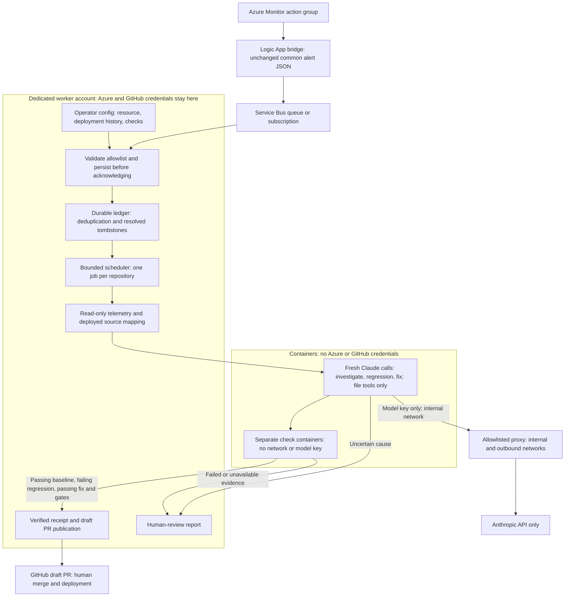

# Local incident worker

`cenci incident run --config /absolute/path/incidents.json` runs an opt-in,
foreground supervisor. Nothing in `cenci daemon` enables or starts it. Use one
state directory for a worker's lifetime, including upgrades and restarts. The
initial coding adapter is Claude Code in Docker or Podman; Service Bus intake,
the durable scheduler, telemetry, and publication are independent interfaces.



Follow the setup sections in order, then complete the staging smoke test before
enabling the service. Examples use a dedicated Linux account named `incident`,
Docker, a Go repository, and a queue; replace the example resource/repository IDs.

## Provisioning and permissions

Have a human configure an Azure Monitor action group/Logic App bridge to send the
[common alert schema](https://learn.microsoft.com/en-us/azure/azure-monitor/alerts/alerts-common-schema)
unchanged to a Service Bus queue or topic subscription. Enable resolved
notifications. The first release accepts exactly one allowlisted alert target
per message; ambiguous multi-resource messages go to the broker dead-letter
queue rather than guessing a repository. Use normal peek-lock delivery, not
sessions or receive-and-delete. Keep the broker backlog long enough to cover
offline periods. Configure broker `MaxDeliveryCount` and monitor its DLQ.

Run the worker under a dedicated local account. Give its Azure identity Service
Bus Data Receiver on this queue/subscription and read-only Log Analytics query
access on the mapped workspaces. Authentication uses Azure's
`DefaultAzureCredential` (environment, managed identity, or local Azure CLI).
Use a dedicated least-privilege identity, rather than a production contributor's
CLI login. The telemetry client sends only the trusted configured KQL query to
the Log Analytics query endpoint, with a 30-minute window around the alert.
Alert descriptions, URLs, queries, and logs never select credentials, commands,
resources, repositories, deployment commits, or network destinations.

The bridge identity needs **Azure Service Bus Data Sender** on the queue; the
worker needs **Azure Service Bus Data Receiver** on that queue and **Log Analytics
Reader** on each configured workspace (or narrower table query permissions).
An Azure administrator assigns these roles; the worker does not create resources
or role assignments. See the [Service Bus role scopes](https://learn.microsoft.com/en-us/azure/service-bus-messaging/service-bus-managed-service-identity)
and [workspace query permissions](https://learn.microsoft.com/en-us/azure/azure-monitor/logs/manage-access).
Configure the Logic App's Service Bus send action to use the incoming request
body as the message body, without stringifying/wrapping it in another JSON object.
Use an alert rule that sends both `Fired` and `Resolved` notifications.

The worker account also needs local Git checkouts, Git branch push access, and
`gh` authentication for draft PR writes. Require human approval in repository
branch protection and deployment environments; do not grant this account merge,
deployment, infrastructure, or production write permission. There is no worker
operation to merge, enable automerge, deploy, or mutate production resources.

Prepare an image containing a current Claude Code CLI (at least v2.1.248), Git,
the project stack, and all dependencies needed for offline checks. Supply
`ANTHROPIC_API_KEY` to the worker; the runtime forwards only that named secret
to agent containers. The image must not embed production or GitHub credentials.
No user home, Azure/GitHub credential files, runtime socket, or main checkout is
mounted into jobs. Agents see the incident worktree and a read-only bare history
clone and deployed source snapshot. A read-only `.git` pointer to that isolated
metadata view replaces the host linked-worktree pointer inside containers, so Git
status/VCS build probes work without exposing host repository credentials.
Claude runs in restricted mode with file tools only; commands execute
through the separate check runner without the model key. Repository-defined
hooks, MCP servers, shell tools, and persisted agent sessions are disabled.

Create a **dedicated internal** Docker/Podman network and a proxy on it that
allows only the model API (for example `api.anthropic.com:443`), denies metadata
endpoints, private/production destinations, and arbitrary CONNECT requests, and
enforces any required provider billing limit. Do not attach production services
to this network. The worker refuses a network whose `Internal` flag is false.
It never provisions or alters this network or proxy. Agent containers use the
proxy; check containers use `--network none` and receive no model key. Container
roots are read-only, capabilities are dropped, privilege escalation is disabled,
and CPU, memory, and process counts are bounded. Local container administration
and the operator's image/proxy are trusted boundaries.

### 1. Prepare the account and repository

Install `cenci`, Docker Engine, Git, and `gh` on the worker host. The account must
be able to run Docker and reach Azure identity, Service Bus, Log Analytics, and
GitHub endpoints from the host. Authenticate Git and `gh` as the dedicated bot
using your organization's approved credential method. These credentials remain
on the host. For HTTPS clones, `gh auth setup-git` configures Git to use the
existing `gh` login; `gh auth status` verifies it without printing the token.

Run as the `incident` account:

```bash
install -d -m 700 /home/incident/.config/cenci /home/incident/.local/state/cenci/incidents
install -d -m 700 /home/incident/repos /home/incident/incident-setup
git clone https://github.com/contoso/orders.git /home/incident/repos/orders
git -C /home/incident/repos/orders config user.name 'Contoso incident bot'
git -C /home/incident/repos/orders config user.email 'incident-bot@contoso.example'
git -C /home/incident/repos/orders remote get-url origin
realpath /home/incident/repos/orders
git -C /home/incident/repos/orders show origin/main:AGENTS.md
git -C /home/incident/repos/orders show origin/main:.cenci/config.json
git -C /home/incident/repos/orders show 0123456789abcdef0123456789abcdef01234567:docs/runbooks/orders.md
```

The last three commands must succeed. Commit root `AGENTS.md` and a valid cenci
`.cenci/config.json` to the configured base branch before starting: untracked
local files are absent from incident worktrees. Each runbook must exist at the
**deployed commit**, which must be present in this clone. Guidance/config come
from the current base; deployed source/runbooks come from deployment history.
Use the `realpath` output for `resources[].dir`. `origin` must match `repo`
exactly as `https://github.com/OWNER/REPO[.git]` or
`git@github.com:OWNER/REPO.git`; credential-bearing URLs and custom aliases fail
the origin check. Populate deployment timestamps from your release records,
including old releases needed for delayed alerts.

### 2. Build and review the job image

Save this example as `/home/incident/incident-setup/Dockerfile.jobs`. Adapt the
Go version to the repository and add every tool its configured gates need.
Build inputs must be reviewed; pin base image digests in your operator-managed
copy before production use. This example uses the supported Claude CLI minimum;
review newer versions before changing the pin.

```dockerfile
FROM node:22-bookworm-slim AS node
FROM golang:1.25-bookworm
COPY --from=node /usr/local/ /usr/local/
RUN apt-get update && apt-get install -y --no-install-recommends git curl ca-certificates \
    && rm -rf /var/lib/apt/lists/* \
    && npm install -g @anthropic-ai/claude-code@2.1.248
ENV GOMODCACHE=/opt/go-mod GOPATH=/tmp/go GOCACHE=/tmp/go-build \
    GOTOOLCHAIN=local GOFLAGS=-mod=readonly
WORKDIR /opt/dependencies
COPY go.mod go.sum ./
RUN go mod download && chmod -R a+rX /opt/go-mod
WORKDIR /tmp
```

```bash
docker build -f /home/incident/incident-setup/Dockerfile.jobs -t incident-tools:reviewed /home/incident/repos/orders
docker run --rm --entrypoint claude incident-tools:reviewed --version
```

For multi-module repos, preload every module's dependencies; for other stacks,
replace Go with their toolchains, offline packages and writable cache locations.
The worker overrides the entrypoint, sets the host UID/GID and `HOME=/tmp`, and
mounts the image root read-only with only `/tmp` and the worktree writable. Tools
installed solely in `/root`, dependencies needing downloads, and caches under a
read-only image path will fail. The image must have no embedded credentials.

### 3. Give the proxy an outbound route

An [internal Docker network](https://docs.docker.com/reference/cli/docker/network/create/#network-internal-mode---internal)
has no external route. Attach **only the proxy** to both the internal job network
and a separate outbound network; agents get only the internal network. Do not
publish proxy ports to the host. Internal networks can still reach host gateway
services, so keep those interfaces free of sensitive listeners or block them with
the host firewall; do not treat `--internal` as isolation from the Docker host.

Save `/home/incident/incident-setup/Dockerfile.proxy`:

```dockerfile
FROM debian:bookworm-slim
RUN apt-get update && apt-get install -y --no-install-recommends squid ca-certificates \
    && rm -rf /var/lib/apt/lists/*
ENTRYPOINT ["squid", "-N", "-f", "/etc/squid/squid.conf"]
```

Save `/home/incident/incident-setup/squid.conf`. These
[Squid ACLs](https://www.squid-cache.org/Doc/config/acl/) allow only CONNECT to the
exact model hostname on port 443, after rejecting private/reserved destinations.
The proxy does not decrypt TLS and does not need the model key.

```text
http_port 3128
acl CONNECT method CONNECT
acl tls_port port 443
acl model_api dstdomain -n api.anthropic.com
acl forbidden dst 0.0.0.0/8 10.0.0.0/8 100.64.0.0/10 127.0.0.0/8 169.254.0.0/16 172.16.0.0/12 192.168.0.0/16 224.0.0.0/4 240.0.0.0/4
acl forbidden dst ::/128 ::1/128 fc00::/7 fe80::/10 ff00::/8
http_access deny forbidden
http_access allow CONNECT tls_port model_api
http_access deny all
cache deny all
access_log stdio:/tmp/access.log
cache_log /tmp/cache.log
pid_filename /tmp/squid.pid
```

```bash
docker build -f /home/incident/incident-setup/Dockerfile.proxy -t incident-proxy:reviewed /home/incident/incident-setup
docker network create --internal cenci-incident-model
docker network create cenci-incident-egress
docker create --name model-proxy --restart unless-stopped --network cenci-incident-egress --mount type=bind,src=/home/incident/incident-setup/squid.conf,dst=/etc/squid/squid.conf,readonly incident-proxy:reviewed
docker network connect --alias model-proxy cenci-incident-model model-proxy
docker start model-proxy
docker network inspect --format '{{.Internal}}' cenci-incident-model
docker run --rm --network cenci-incident-model --entrypoint curl incident-tools:reviewed --max-time 20 --proxy http://model-proxy:3128 -I https://api.anthropic.com/
docker run --rm --network cenci-incident-model --entrypoint curl incident-tools:reviewed --max-time 20 --proxy http://model-proxy:3128 -I https://example.com/
docker run --rm --network cenci-incident-model --entrypoint curl incident-tools:reviewed --max-time 20 --proxy http://model-proxy:3128 -I https://169.254.169.254/
docker run --rm --network cenci-incident-model --entrypoint curl incident-tools:reviewed --max-time 5 --noproxy '*' -I https://api.anthropic.com/
```

Expect `true` from network inspection, an HTTP response from Anthropic (a 4xx
without credentials is acceptable), proxy `403` denials for both forbidden URLs,
and a failed direct connection. Investigate any other result before proceeding.
Inspect proxy denials with `docker exec model-proxy tail -n 50 /tmp/access.log`.
These probes verify routing/ACLs; the staging job below verifies authenticated
Claude execution. This proxy enforces destinations, not a spending cap: configure
provider limits or a billing-aware proxy separately if a hard ceiling is needed.

Podman is also supported: provision equivalent internal/outbound networks and
proxy connectivity with Podman, set `agent.runtime` to `podman`, and use image
names visible in that account's image store. The worker adds `--userns=keep-id`;
verify bind mounts with your SELinux policy. Complete the same probes and smoke
test with your chosen runtime; do not mix Docker and Podman networks/images.

## Configuration

Paths below are illustrative; use canonical absolute checkout paths. Keep this
config outside the repository so alert-driven changes cannot rewrite policy.

```json
{
  "enabled": true,
  "stateDir": "/home/incident/.local/state/cenci/incidents",
  "namespace": "contoso.servicebus.windows.net",
  "queue": "monitor-alerts",
  "concurrency": 2,
  "timeoutSeconds": 1800,
  "maxAttempts": 2,
  "budgetUsd": 6,
  "agent": {
    "runtime": "docker",
    "image": "incident-tools:reviewed",
    "apiKeyEnv": "ANTHROPIC_API_KEY",
    "network": "cenci-incident-model",
    "proxyUrl": "http://model-proxy:3128"
  },
  "resources": [{
    "id": "/subscriptions/00000000-0000-0000-0000-000000000000/resourceGroups/app/providers/Microsoft.Web/sites/orders",
    "repo": "contoso/orders",
    "dir": "/home/incident/repos/orders",
    "base": "main",
    "environment": "production",
    "deployments": [{
      "commit": "0123456789abcdef0123456789abcdef01234567",
      "from": "2026-10-10T08:00:00Z",
      "until": "2026-10-11T08:00:00Z"
    }],
    "runbooks": ["docs/runbooks/orders.md"],
    "workspace": "00000000-0000-0000-0000-000000000000",
    "query": "AppExceptions | where _ResourceId =~ '/subscriptions/00000000-0000-0000-0000-000000000000/resourceGroups/app/providers/Microsoft.Web/sites/orders' | project TimeGenerated, ProblemId, OuterMessage | take 100",
    "regression": ["go", "test", "./..."],
    "checks": [["go", "test", "./..."], ["go", "vet", "./..."]],
    "testPaths": ["*_test.go", "internal/orders/*_test.go"],
    "workflow": "Follow the repository's configured cenci implementation stages, applicable AGENTS.md guidance, and project gates. Worker owns Git commit, branch push and draft publication; stop for human review if any required stage cannot run."
  }]
}
```

For a topic, omit `queue` and set `topic` and `subscription`. Defaults never enable
the worker. Invalid limits, overlapping deployment intervals, and incomplete
policy fail startup. Concurrency is 1–16, timeout is 1–86400 seconds, attempts are
1–10, and reserved budget is $0.03–$10000 per attempt. Deployment intervals are
`[from, until)`; omit `until` only
for the currently deployed release. Keep deployment history for offline alerts.
Intake chooses the commit deployed **at fired time**, never the latest checkout
or a commit named by alert text. Missing historical metadata produces a durable
human-review report. Mappings are captured with the incident and survive config
edits; cancel affected queued/active incidents before revoking a mapping.

`testPaths` uses Go `filepath.Match`, with repository-relative paths; `*` does
not cross directory separators. Check and regression commands are argument
arrays, not alert-provided shell strings. Include every required project gate in
`checks`, including build/lint gates required by AGENTS.md. Dependencies must be
baked into the image because checks cannot fetch packages or contact production.
The agent receives the configured workflow, root AGENTS.md, repository cenci
config, deployed runbooks, and instructions to read relevant nested AGENTS.md.
If a repository workflow needs unavailable services or interactive approval, the
agent must return `review` rather than claim that stage ran.

Save the adapted JSON as `/home/incident/.config/cenci/incidents.json` (mode
0600). Create `/home/incident/.config/cenci/incidents.env` with mode 0600 **before**
entering secrets. For a service principal, use the following environment-file
shape; obtain values from the credential owner rather than putting them in shell
history. Managed identity installations omit the tenant/client-secret entries
and configure the intended identity instead.

```text
AZURE_TENANT_ID=your-tenant-id
AZURE_CLIENT_ID=your-worker-client-id
AZURE_CLIENT_SECRET=your-worker-client-secret
ANTHROPIC_API_KEY=your-model-key
```

The example service below loads this file. For a foreground staging run, load
these same variables through your approved secret manager into the worker's
environment, then run `cenci incident run --config
/home/incident/.config/cenci/incidents.json`. Do not place GitHub or Azure secrets
in the image or the JSON configuration.

## Lifecycle and recovery

The ledger keys incidents by a hash of Azure `alertId`, independently of the
Service Bus message ID or delivery count. A resolved event is a permanent
tombstone for that alert identity, including if it arrives before the fired
delivery. Conflicting resource/fired-time reuse is dead-lettered. New occurrences
must have new Azure alert identities.

Intake fsyncs the ledger file and directory before completing a message. It
renews the broker lock during intake. Lock loss or uncertain settlement can
redeliver, but cannot create another local incident. Malformed, unsupported, and
unallowlisted alerts are explicitly dead-lettered. Storage failures abandon the
delivery; broker delivery limits may eventually move it to the DLQ. Inspect the
DLQ in Azure and correct policy/payload/storage before manually replaying; cenci
does not automatically drain it.

Scheduling continues from the local ledger while Azure is offline. There is one
active job per repository and a configured global concurrency bound. Lifetime
worker and per-repository OS locks prevent overlapping local supervisors. On
restart, the worker removes only containers carrying its persistent owner label,
then recovers interrupted jobs. The random owner identity is stored in `owner-id`
inside the state directory under the ledger lock, so path aliases that open the
same state share cleanup ownership, including on case-insensitive filesystems.
Separately initialized state directories have separate identities. Never start
another worker with a different state directory to bypass recovery. Back up the owner identity together
with the ledger and artifacts; do not delete or rename its file. Deleting state
destroys deduplication and cleanup history. There is no automatic pruning.
Before upgrading a prerelease build that used path-derived owner labels, stop
its worker and any containers it owns. The new identity cannot safely select
those legacy containers for automatic cleanup.

Each attempt reserves `budgetUsd`, split across three fresh agent calls:
investigation, regression test, and fix. Reservations are never refunded after
a crash. `maxAttempts * budgetUsd` bounds reserved estimated cost per incident;
there is also an execution deadline and 40-turn cap per call. Claude's
[`--max-budget-usd`](https://code.claude.com/docs/en/cli-reference) uses estimated
spend and can overshoot on a request; a provider/proxy billing control is needed
for a strict financial ceiling. Missing/over-budget cost results are rejected.
Publishing retries do not invoke another agent or reserve another coding budget.

The worker requires a passing baseline, then test-only changes whose regression
command fails, then a fix with that test preserved, passing regression and all
configured checks. Failure or uncertainty creates a report for review. Partial
edits after interruption stay in the worktree for review; they are never reset
or silently overwritten. Git hooks, fsmonitor commands, and signing are disabled
for host-side worker Git operations.

Before push/PR creation, a synced receipt records the verified head and PR body.
Each alert has one stable branch. Reconciliation searches open **and closed** PRs
for that exact repository/head/base before creation, including after an uncertain
create response. A second synced intent is saved immediately before the create
request. If a prior create was attempted but GitHub cannot confirm the result,
the worker leaves a human-review report and never sends another create request;
an empty inventory is not proof the original request failed. A verified receipt
can resume publication without coding again.
A changed head, missing/corrupt worktree Git metadata, or missing receipt requires
human review.
Keep publication worktrees until reconciliation finishes; the worker preserves
their artifacts for manual recovery instead of retrying missing local state.
Temporary execution failures such as interrupted Git probes remain retryable.
Existing closed/merged PRs are recorded rather than replaced. The `draft`
terminal status means a PR
reference exists; consult GitHub for its current lifecycle state.

```bash
cenci incident status --state-dir /home/incident/.local/state/cenci/incidents
cenci incident cancel --state-dir /home/incident/.local/state/cenci/incidents --id INCIDENT_KEY
```

Status is JSON, including incident reference, deployment, attempts, reserved cost,
report, and PR URL. Reports and original evidence are sensitive: state directories
are mode 0700 and files mode 0600. Full investigation inputs/results are retained
under `artifacts/<key>/`; PR bodies use bounded excerpts. Cancel/resolved signals
stop active subprocesses and containers and prevent queued jobs from starting.
A network request already accepted by GitHub can still complete while cancellation
arrives; its stable branch allows later manual reconciliation. Cancellation never
deletes an existing PR or deploys a fix.

For always-on operation, run this foreground command under the user's service
manager with `Restart=on-failure` and a private environment file. Stop it with
SIGTERM for graceful shutdown. Enabling the service is an explicit operator step;
installing or starting the normal attention daemon does not opt in.

Example user service (`~/.config/systemd/user/cenci-incident.service`):

```ini
[Unit]
Description=cenci local incident worker

[Service]
ExecStart=%h/.local/bin/cenci incident run --config %h/.config/cenci/incidents.json
EnvironmentFile=%h/.config/cenci/incidents.env
Restart=on-failure
RestartSec=10
TimeoutStopSec=45
KillMode=control-group

[Install]
WantedBy=default.target
```

Protect the environment file with mode 0600. After saving the unit, run
`systemctl --user daemon-reload`; use `systemctl --user enable --now
cenci-incident` only after staging verification. Desktop logout survival also
requires the operator to configure user lingering. Podman jobs use `keep-id` so
the worker's UID can edit its worktree; ensure host SELinux/bind-mount policy and
the reviewed image permit that access.

## Staging smoke test

Use a staging-only queue, resource, workspace, and GitHub repository with a known
small application defect, a passing existing test suite, committed guidance and
a deployed runbook describing the symptom. Set deployment history to include the
payload's fired time. Use `concurrency: 1`, `maxAttempts: 1` and an affordable
`budgetUsd` for the first run. Model outcomes are nondeterministic: a `review`
result is safe, but does not prove the draft-PR path works. Resolve setup failures
and repeat with a **new** alert identity until the complete path is exercised.

First check offline dependencies under the same read-only image, host UID and
writable `/tmp` constraints. For the Go example:

```bash
git -C /home/incident/repos/orders worktree add --detach /home/incident/incident-setup/preflight origin/main
INCIDENT_UID=$(id -u) || exit 1
INCIDENT_GID=$(id -g) || exit 1
docker run --rm --network none --read-only --cap-drop=ALL --security-opt=no-new-privileges --pids-limit=128 --memory=2g --cpus=2 --user "$INCIDENT_UID:$INCIDENT_GID" --tmpfs /tmp:rw,nosuid,size=512m,mode=1777 --env HOME=/tmp --volume /home/incident/incident-setup/preflight:/workspace:rw --workdir /workspace --entrypoint go incident-tools:reviewed test -buildvcs=false ./...
```

Expect exit 0 without package downloads or permission failures. The preflight
disables VCS stamping because it has no mounted Git metadata; real jobs supply
isolated metadata and run the exact configured gates. Adapt the command for your
stack, and ensure every gate works offline during the full smoke run.

Start the worker in a foreground terminal with its credentials loaded. In a
**separate sender terminal**, authenticate as the staging bridge/test identity
with Service Bus Data Sender; the worker's Receiver role cannot send. Install
Python `azure-identity` and `azure-servicebus` in a dedicated virtual environment,
as in the [Azure Python queue quickstart](https://learn.microsoft.com/en-us/azure/service-bus-messaging/service-bus-python-how-to-use-queues).
For example, create `/home/incident/incident-setup/sender-venv` with
`python3 -m venv`, activate it, then run `python -m pip install azure-identity
azure-servicebus` in that sender terminal.
Save this small sender as `/home/incident/incident-setup/send-alert.py`:

```python
import json
import sys
import uuid
from pathlib import Path
from azure.identity import DefaultAzureCredential
from azure.servicebus import ServiceBusClient, ServiceBusMessage

payload = json.loads(Path(sys.argv[1]).read_text())
with DefaultAzureCredential() as credential:
    with ServiceBusClient("contoso.servicebus.windows.net", credential) as client:
        with client.get_queue_sender("monitor-alerts") as sender:
            sender.send_messages(ServiceBusMessage(
                json.dumps(payload), content_type="application/json",
                message_id=str(uuid.uuid4())))
```

Replace the namespace and queue in the sender with the **staging** values.
Save `/home/incident/incident-setup/fired.json` using the mapped staging resource,
a unique alert identity for this smoke run, and a fired time covered by the
deployment interval and staging telemetry:

```json
{
  "schemaId": "azureMonitorCommonAlertSchema",
  "data": {
    "essentials": {
      "alertId": "cenci-staging-smoke-2026-10-10-001",
      "monitorCondition": "Fired",
      "alertTargetIDs": ["/subscriptions/00000000-0000-0000-0000-000000000000/resourceGroups/app/providers/Microsoft.Web/sites/orders"],
      "firedDateTime": "2026-10-10T09:00:00Z",
      "description": "Staging fixture: describe the known application defect and observable symptom."
    }
  }
}
```

```bash
python /home/incident/incident-setup/send-alert.py /home/incident/incident-setup/fired.json
cenci incident status --state-dir /home/incident/.local/state/cenci/incidents
```

Use repeated `status` calls and the following acceptance checks. Retain the
incident key, reports, and PR URL as the staging record; do not delete the ledger
between steps.

| Step | Action | Expected result |
| --- | --- | --- |
| Intake | Send the fired payload above. | One ledger row, the mapped deployed SHA, then `queued`/`running` (these may be brief); Service Bus active message count falls after durable intake. |
| Coding and publication | Wait for completion; inspect `artifacts/<key>/investigation-input.json`, `investigation-result.json`, and `publication.json`, plus the draft PR. | Authenticated Claude calls succeed through the proxy; baseline passes, added regression fails before the fix and passes after it; every configured gate passes offline; `draft` has one PR URL with evidence and verification. A `review` report explains any stopped stage. |
| Duplicate delivery | Run the same sender command again; it creates a new broker message ID with the same `alertId`. | Same ledger key, attempts/reserved cost and PR; no second coding job or PR. |
| Restart | Stop the foreground worker with Ctrl-C, restart with the same config/state, then resend `fired.json`. | Completed incident stays terminal with the same PR and cost; no duplicate job. For interrupted-job recovery, use a separate identity and stop during a running job: partial edits may correctly produce `review`. |
| Resolution | Copy the payload to `resolved.json`, change only `monitorCondition` to `Resolved`, then send it with the same script. | Row becomes `resolved`; queued/active execution stops, existing PR stays available. Sending the original fired payload again cannot restart it. |
| Out-of-order resolution | Use a new `alertId`; send its resolved payload before its fired payload. | One `resolved` tombstone with zero attempts and no PR. |
| Bridge delivery | Trigger and resolve the real staging Azure Monitor alert through the configured action group/Logic App. | The bridge preserves the schema/resource/identity; the same intake and resolution behavior occurs. Direct queue sends alone do not verify the bridge. |

If intake never appears, inspect the bridge run, Service Bus DLQ, resource
allowlist, and the worker's Azure permissions. If a row retries or ends in
`review`, inspect its `report` first, then image tools/caches, proxy logs, Git
authentication/author, deployment SHA and runbook availability. Confirm real
telemetry was returned rather than accepting an empty-query result as proof of
the fixture. Only after these checks should you enable the user service and map
production resources. This procedure is an operator acceptance test; the local
test suite below does not execute it or provision its infrastructure.

## Automated verification

The `internal/incident` integration suites exercise durable intake/scheduling and
real Git worktrees with executable Go regression tests. Azure, model execution,
and GitHub are injected at their boundaries; no test uses production credentials.

| Requirement | Named test |
| --- | --- |
| Duplicate delivery and worker restart | `TestDurableDeliveryAndRestart` |
| Offline backlog | `TestOfflineBacklogRecovery` |
| Expired/renewed broker locks and redelivery | `TestLockRenewalExpiryAndRedelivery` |
| Resolved alerts and missing historical deployment | `TestResolvedCancelledAndMissingDeployment` |
| Failed checks, uncertain infrastructure, test tampering | `TestFailedChecksAndUncertainCauseProduceReports` |
| Retry after PR creation | `TestRetryAfterPRCreationDoesNotReinvokeAgent` |
| Ambiguous creation with temporarily empty inventory | `TestAmbiguousCreationWithEmptyLookupCannotCreateSecondPR` |
| Crash in last-attempt publication | `TestPublishingCrashReconcilesEvenAfterLastAttempt` |
| Repository/global concurrency | `TestOneActivePerRepositoryAndBoundedConcurrency` |
| Cancellation and attempts/cost limits | `TestCancellationStopsActiveJob`, `TestBudgetAndRetryExhaustion` |
| Capacity retained during cancellation/resolution cleanup | `TestCancellationAndResolutionRetainCapacityUntilCleanup` |
| Receipt corruption and failed atomic replacement | `TestCorruptPublicationReceiptRequiresHumanReview`, `TestReceiptWriteFailurePreservesPreviousVersion` |
| Malformed messages and settlement/storage failure | `TestDeadLettersAndSettlementFailure` |
| Nested-repository fsmonitor cannot execute on the host | `TestHostGitDoesNotExecuteEmbeddedRepositoryFSMonitor` |
| Fresh regression agent receives the investigation diagnosis | `TestFreshRegressionAgentReceivesInvestigation` |
| Missing publication worktree needs review; interrupted probe can retry | `TestPublicationUnavailableWorktreeRequiresHumanReview`, `TestPublicationInterruptedHeadProbeRemainsRetryable` |
| Equivalent physical state paths share cleanup ownership; case-distinct paths do not | `TestOwnerCleanupAcrossEquivalentStateDirectories`, `TestOwnerCleanupPreservesCaseDistinctStateDirectory` |
| Check launch through path aliases and safe identity resolution failures | `TestOwnerCheckLaunchUsesCanonicalStateDirectory`, `TestOwnerResolutionFailurePreventsRuntimeCommands`, `TestOwnerInvalidIdentityPreventsRuntimeCommands` |
| Persistent cleanup identity across restart and directory rename | `TestOwnerIdentityPersistsAcrossRestartAndDirectoryRename` |
| Concurrent startup uses one durable identity | `TestOwnerConcurrentInitializationUsesOneIdentity` |
| Valid ownership permits orphan cleanup before corrupt-ledger recovery fails | `TestOwnerCleanupSurvivesCorruptLedger` |

Live Azure delivery, production RBAC, the operator's container image and proxy,
and actual model/GitHub calls require a staging smoke test before enabling this
worker on production alert sources.
