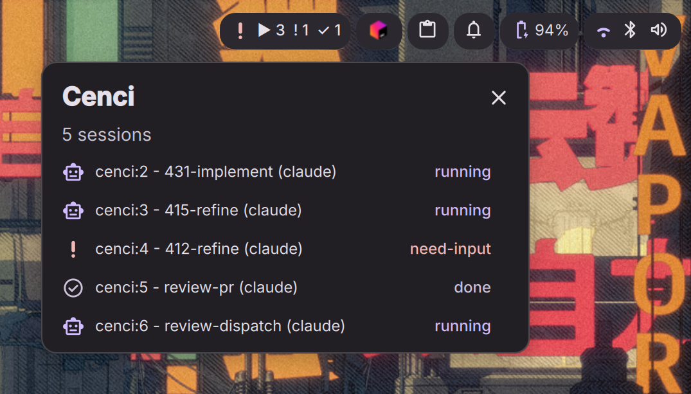

# Cenci — DankMaterialShell bar widget

Live counts of Claude Code and Codex tmux sessions in your DankMaterialShell (DMS) bar. Polls `cenci waybar` and renders the snapshot.



*The bar pill summarizes every live agent session; click it to see which work is
running, done, or waiting for input.*

## Requirements

- [DankMaterialShell](https://danklinux.com/docs/dankmaterialshell/) (recent build with the plugin system)
- [cenci](https://github.com/matteobortolazzo/cenci/tree/main/watch) daemon running on your tmux server
- `cenci` binary on `$PATH`. The plugin bootstrap auto-links it onto your
  writable PATH (`~/.local/bin`) on every session, and `install.sh` sets up
  visibility for GUI bars by offering a one-time `/usr/local/bin` link (see
  below). If your bar still can't find it, set `cenciPath` to the binary's
  full path in plugin settings.

## Install

The [one-command installer](../../README.md#installation) auto-detects
DankMaterialShell and wires this widget up for you (on both install and
`cenci update`). To do it directly — from the marketplace checkout or a
repo checkout:

```sh
~/.claude/plugins/marketplaces/cenci/watch/plugin/dms/install.sh
# from a repo checkout, inside watch/: ./plugin/dms/install.sh
```

It symlinks this plugin into `~/.config/DankMaterialShell/plugins/cenci` and
restarts DMS so it picks the plugin up. It's idempotent — re-run after any
`cenci` update. You still enable the widget and add it to a bar section once
(below).

### Install (manual / local dev)

Symlink this directory into DMS's plugin folder:

```sh
ln -s "$PWD/plugin/dms" ~/.config/DankMaterialShell/plugins/cenci
```

Restart DMS so it picks the new plugin up:

```sh
systemctl --user restart dms
# or: pkill -f 'qs -c dms'  (niri.service Wants=dms will re-spawn it)
```

Then open Settings (`dms ipc call settings toggle`) → **Plugins** → enable **Cenci** → **DankBar** → add the widget to a section.

## Uninstall

`cenci-installer uninstall` removes this widget as part of removing the whole
attention layer. To do it directly — from the marketplace checkout or a repo
checkout:

```sh
~/.claude/plugins/marketplaces/cenci/watch/plugin/dms/uninstall.sh
# from a repo checkout, inside watch/: ./plugin/dms/uninstall.sh
```

It removes the `~/.config/DankMaterialShell/plugins/cenci` symlink (if it's
still the one this plugin created) and restarts DMS so the change takes
effect immediately.

## Behavior

- Polls every `pollIntervalMs` (default 2000 ms).
- Hides when cenci reports no sessions (or the daemon is down).
- Icon + color reflect the highest-priority status:
  `need-input` (error) > `running` (primary) > `done` (tertiary) > `stopped` (secondary) > `idle` (muted).
- Click the pill to open a popout listing each window: `session:index - name` with the per-session status badge.
- When the daemon's fleet dispatch loop is enabled, a compact `⟳` glyph and a `dispatch: on (...)` tooltip line appear. The pill no longer hides when there are zero live sessions but the loop is enabled (`alt: "dispatch-only"`) — only a true `alt: "none"` (no sessions and dispatch disabled/absent) hides it.
- Right-click is unused (open plugin settings via Settings → Plugins → Cenci).

## Settings

| Key | Default | Notes |
|---|---|---|
| `pollIntervalMs` | `2000` | How often to call `cenci waybar` |
| `cenciPath` | `cenci` | Path or command name for the cenci binary |

## Troubleshooting

- **Pill never appears**: first confirm the bar can *find* the binary. GUI/compositor bars inherit the **login** PATH, which typically lacks `~/.local/bin` — so a bare `cenci` the daemon set up for your shell may be invisible to DMS. Reproduce the bar's environment with a minimal PATH:
  ```sh
  env -i HOME=$HOME XDG_RUNTIME_DIR=/run/user/$(id -u) PATH=/usr/local/bin:/usr/bin sh -c 'cenci waybar'
  ```
  If that says "command not found", link the binary onto the login PATH (re-run `install.sh` and accept the GUI-bar prompt, or `sudo ln -sf "$HOME/.local/bin/cenci" /usr/local/bin/cenci`) or set `cenciPath` to its full path. If it prints `"alt": "none"` there are no live sessions and the fleet dispatch loop is off — start a Claude Code or Codex tmux pane and try again (`"alt": "dispatch-only"` means the pill stays visible even with no sessions, because the dispatch loop is enabled).
- **Pill is stuck**: check the cenci daemon (`pgrep -a cenci`). If it is
  absent after a login or restart, the next installed Claude or Codex lifecycle hook
  starts it on demand and retries that event; no tmux startup entry is required.
- **Logs**: `journalctl --user -u dms -f` or wherever your DMS unit writes.
